# Audible System - Real-Time Cascade Steering

> "See the green circle? Let's move that block to the right."

## Vision

Allow users to **steer cascades in real-time** by injecting feedback mid-phase. The feedback becomes a normal message in the conversation - the remaining turns see it and adjust naturally. Phase encapsulation handles the rest.

**The Metaphor**: Like calling an audible in football - you see something, you call it out, the play adjusts.

## Core Principles

1. **Inject, Don't Rewrite** - Feedback is just a message, not history surgery
2. **Phase Encapsulation** - Mid-phase messiness stays in-phase; next phase only sees final output
3. **Observable** - Audibles appear in logs, traces, and message history
4. **Minimal Effort, Maximum Expression** - "Talk and draw" interface
5. **Leverage Existing Systems** - Works with selective context, turn limits, everything

## The Key Insight

Windlass already encapsulates phases. We don't need to rewrite history - we just inject feedback and let the remaining turns handle it:

```
Phase A (max_turns: 5)
  Turn 1 → output
  Turn 2 → output
  Turn 3 → output         ← USER AUDIBLE: "colors wrong"
  Turn 4 → adjusted       ← agent sees feedback, adjusts
  Turn 5 → final output   ← incorporates correction

Phase B (context: {from: ["previous"]})
  → Only sees Phase A's final output + images
  → Never sees the mid-phase audible conversation
  → Clean slate with corrected artifacts
```

**The audible is just a message. Phase boundaries do the cleanup.**

## Architecture

```
┌─────────────────────────────────────────────────────────────┐
│  Phase Execution (Turn Loop)                                │
├─────────────────────────────────────────────────────────────┤
│                                                             │
│  Turn 1: agent.call() → output                             │
│  Turn 2: agent.call() → output                             │
│  Turn 3: agent.call() → output                             │
│     │                                                       │
│     ↓                                                       │
│  ┌──────────────────────────────────────┐                  │
│  │  🏈 AUDIBLE SIGNAL DETECTED          │                  │
│  │                                      │                  │
│  │  1. Pause execution                  │                  │
│  │  2. Collect feedback (text/draw/voice)                  │
│  │  3. Inject as user message           │                  │
│  │  4. Resume (or retry turn)           │                  │
│  └──────────────────────────────────────┘                  │
│     │                                                       │
│     ↓                                                       │
│  Turn 4: agent.call() → adjusted output (sees feedback)    │
│  Turn 5: agent.call() → final output                       │
│                                                             │
├─────────────────────────────────────────────────────────────┤
│  Phase Output: final corrected result                       │
│  Images: images/{session}/{phase}/*.png                     │
└─────────────────────────────────────────────────────────────┘
                            │
                            ↓ (selective context)
┌─────────────────────────────────────────────────────────────┐
│  Next Phase                                                 │
│  context: {from: ["previous"], include: ["output", "images"]}
│                                                             │
│  → Sees only the corrected final output                    │
│  → Sees only the final images                              │
│  → Audible conversation stays in previous phase            │
└─────────────────────────────────────────────────────────────┘
```

## How It Works

### 1. Audible Signal

User clicks 🏈 in UI → signal sent to runner → execution pauses at next safe point.

```python
# In runner turn loop
for turn in range(max_turns):
    result = self.agent.call(self.context_messages)

    # Check for audible signal (non-blocking poll)
    audible = self._check_audible_signal()

    if audible:
        # Pause and collect feedback
        feedback = self._handle_audible_pause(
            current_output=result,
            turn_number=turn
        )

        # Inject feedback as message
        self.context_messages.append({
            "role": "user",
            "content": self._format_audible_message(feedback)
        })

        # Handle mode
        if feedback.mode == "retry":
            # Don't save last output, redo this turn
            continue  # Same turn number
        else:
            # Save output, continue to next turn
            self.context_messages.append({
                "role": "assistant",
                "content": result
            })
            continue

    # Normal flow - save output
    self.context_messages.append({"role": "assistant", "content": result})
```

### 2. Feedback Collection

The audible creates a checkpoint-style pause:

```python
def _handle_audible_pause(self, current_output, turn_number):
    """
    Create checkpoint for audible feedback collection.
    Returns user's feedback when they submit.
    """
    checkpoint = checkpoint_manager.create_checkpoint(
        session_id=self.session_id,
        cascade_id=self.config.cascade_id,
        phase_name=self.current_phase.name,
        checkpoint_type=CheckpointType.AUDIBLE,
        ui_spec={
            "type": "audible",
            "title": "🏈 Call Audible",
            "current_output": current_output,
            "turn_number": turn_number,
            "turns_remaining": self.current_phase.rules.max_turns - turn_number,
            "recent_images": self._get_recent_images(),
            "sections": [
                {
                    "type": "markdown",
                    "content": f"**Current output (Turn {turn_number + 1}):**"
                },
                {
                    "type": "markdown",
                    "content": current_output
                },
                # Images shown with annotation capability
                *[{
                    "type": "image",
                    "src": img,
                    "annotatable": True
                } for img in self._get_recent_images()],
                {
                    "type": "input",
                    "id": "feedback",
                    "label": "What should change?",
                    "multiline": True,
                    "placeholder": "Describe what's wrong or draw on the images above..."
                },
                {
                    "type": "select",
                    "id": "mode",
                    "label": "Action",
                    "options": [
                        {"value": "continue", "label": "Continue with this feedback"},
                        {"value": "retry", "label": "Retry this turn with feedback"}
                    ]
                }
            ]
        },
        echo_snapshot=self.echo.get_full_echo()
    )

    # Block until user responds
    response = checkpoint_manager.wait_for_response(checkpoint.id)

    return AudibleFeedback(
        text=response.get("feedback", ""),
        annotations=response.get("annotations", []),
        voice_transcript=response.get("voice_transcript"),
        mode=response.get("mode", "continue")
    )
```

### 3. Message Injection

The feedback becomes a regular message - observable in logs and traces:

```python
def _format_audible_message(self, feedback):
    """
    Format audible feedback as a user message.
    This is what the agent sees in subsequent turns.
    """
    content = []

    # Header
    content.append({
        "type": "text",
        "text": f"[AUDIBLE - User Feedback]:\n{feedback.text}"
    })

    # Voice transcript (if any)
    if feedback.voice_transcript:
        content.append({
            "type": "text",
            "text": f"\n[Voice]: {feedback.voice_transcript}"
        })

    # Annotated images (if any)
    for annotation in feedback.annotations:
        content.append({
            "type": "text",
            "text": "\n[Annotated image showing requested changes]:"
        })
        content.append({
            "type": "image_url",
            "image_url": {"url": annotation}
        })

    # Instruction based on mode
    if feedback.mode == "retry":
        content.append({
            "type": "text",
            "text": "\nPlease redo your last response incorporating this feedback."
        })
    else:
        content.append({
            "type": "text",
            "text": "\nPlease incorporate this feedback in your next response."
        })

    return content
```

### 4. Observable in Logs

Audibles are logged like any other message:

```python
# Logged automatically via echo.add_history()
{
    "role": "user",
    "content": "[AUDIBLE - User Feedback]: The colors should be blue...",
    "node_type": "audible",
    "metadata": {
        "audible_mode": "retry",
        "has_annotations": True,
        "has_voice": False,
        "turn_number": 3,
        "triggered_at": "2025-01-15T10:30:00Z"
    }
}
```

Query audibles:
```sql
SELECT
    session_id,
    phase_name,
    content_json,
    metadata_json
FROM unified_logs
WHERE node_type = 'audible'
ORDER BY timestamp DESC;
```

## The "Talk and Draw" Interface

### Why This Matters

Traditional feedback requires precise language:
> "The chart is wrong. The X-axis should show months instead of days, and the bar for Q3 should be highlighted in a different color, maybe blue, and can you move the legend to the bottom?"

Talk and draw is natural:
> *[circle the X-axis]* "months not days"
> *[arrow to Q3 bar]* "make this blue"
> *[box at bottom]* "legend here"

**Same information. 10x less effort. 10x clearer.**

### Multimodal Feedback

```
┌─────────────────────────────────────────────────────────────┐
│  🏈 Call Audible                          Turn 3/5         │
├─────────────────────────────────────────────────────────────┤
│                                                             │
│  Current Output:                                            │
│  ┌─────────────────────────────────────────────────────┐   │
│  │                                                     │   │
│  │   📊 [Chart Image - ANNOTATABLE]                   │   │
│  │                                                     │   │
│  │      User can draw:                                │   │
│  │      - Circles to highlight                        │   │
│  │      - Arrows to point                             │   │
│  │      - Text labels                                 │   │
│  │      - Strikethroughs                              │   │
│  │                                                     │   │
│  └─────────────────────────────────────────────────────┘   │
│                                                             │
│  ┌─────────────────────────────────────────────────────┐   │
│  │ 🎤 [Record] │ What should change?                   │   │
│  │             │                                       │   │
│  │             │ "See where I circled? Those labels   │   │
│  │             │  should be months, and the bar I     │   │
│  │             │  pointed to needs to be blue"        │   │
│  └─────────────────────────────────────────────────────┘   │
│                                                             │
│  Action: ○ Continue with feedback  ● Retry this turn       │
│                                                             │
│  [Cancel]                              [Submit Feedback]    │
└─────────────────────────────────────────────────────────────┘
```

## Configuration

### Phase-Level

```json
{
  "name": "generate_dashboard",
  "instructions": "Create a dashboard...",
  "tackle": ["create_chart", "create_vega_lite"],
  "rules": {
    "max_turns": 5
  },
  "audibles": {
    "enabled": true,
    "budget": 3,
    "allow_retry": true,
    "timeout_seconds": 120
  }
}
```

### Cascade-Level Defaults

```json
{
  "cascade_id": "analytics_pipeline",
  "audibles": {
    "enabled": true,
    "default_budget": 5
  },
  "phases": [...]
}
```

## Two Modes

### Continue Mode

User sees something, wants to steer without losing current progress:

```
Context before audible:
  [system prompt]
  [user: create a chart]
  [assistant: Here's the chart... (IMAGE_A)]

Context after audible (continue mode):
  [system prompt]
  [user: create a chart]
  [assistant: Here's the chart... (IMAGE_A)]
  [user: [AUDIBLE] The colors should be blue + (ANNOTATED_IMAGE)]  ← injected

Next turn:
  Agent sees the audible, adjusts approach
  Produces new output incorporating feedback
```

### Retry Mode

User sees something clearly wrong, wants a redo:

```
Context before audible:
  [system prompt]
  [user: create a chart]
  [assistant: Here's the chart... (IMAGE_A)]  ← about to save this

Audible intercepts BEFORE saving:
  [system prompt]
  [user: create a chart]
  [user: [AUDIBLE] That's wrong, should be X + (ANNOTATION). Please redo.]  ← injected

Same turn retries:
  Agent sees the audible, redoes the turn
  Turn count unchanged
```

## Image Handling

Images are saved to `images/{session}/{phase}/` by tools like `create_chart`.

**On audible with image feedback:**
1. Agent sees annotated image in audible message
2. Agent regenerates chart (if retry mode) or creates adjusted version
3. New image saved to same directory (e.g., `image_1.png`)
4. Phase completes with corrected images in folder

**Next phase:**
```json
{
  "context": {
    "from": ["previous"],
    "include": ["images", "output"]
  }
}
```
- Receives all images from folder (including corrected ones)
- Receives final output (which describes the corrected state)
- Never sees mid-phase audible back-and-forth

## Implementation Phases

### Phase 1: Text Injection Foundation ✅ COMPLETE

**Goal**: Basic audible with text feedback

- [x] Add `CheckpointType.AUDIBLE`
- [x] Audible signal mechanism (UI → backend → runner)
- [x] Safe-point checking in turn loop
- [x] Checkpoint creation for feedback collection
- [x] Text feedback UI (simple modal)
- [x] Message injection into context
- [x] Continue vs Retry modes
- [x] Budget tracking per phase
- [x] Logging with `node_type: "audible"`

**Files modified:**
- `windlass/windlass/runner.py` - Turn loop audible check, injection logic, signal handling
- `windlass/windlass/checkpoints.py` - Added AUDIBLE checkpoint type
- `windlass/windlass/cascade.py` - Added AudibleConfig to PhaseConfig
- `dashboard/backend/checkpoint_api.py` - Audible signal/status/clear endpoints
- `dashboard/frontend/src/components/CheckpointPanel.js` - Audible checkpoint routing
- `dashboard/frontend/src/components/CheckpointView.js` - Audible type badge
- `dashboard/frontend/src/components/DetailView.js` - Audible button when running
- New: `dashboard/frontend/src/components/AudibleModal.js` - Feedback collection component
- New: `dashboard/frontend/src/components/AudibleModal.css` - Styling

**Test cascade:** `examples/audible_demo.json`

### Phase 2: Image Annotation

**Goal**: Draw on images to provide visual feedback

- [ ] Simple canvas overlay component
- [ ] Drawing tools (pen, shapes, text)
- [ ] Composite export (original + annotations)
- [ ] Multimodal audible message formatting
- [ ] Image display in audible modal

**New components:**
- `ImageAnnotator.js` - Canvas overlay for drawing
- `AnnotationToolbar.js` - Tool selection

**Test cascade:**
```json
{
  "cascade_id": "audible_charts_test",
  "phases": [{
    "name": "generate_charts",
    "instructions": "Create charts for {{ input.data }}",
    "tackle": ["create_chart", "create_vega_lite"],
    "rules": {"max_turns": 5},
    "audibles": {"enabled": true, "budget": 3}
  }]
}
```

### Phase 3: Voice Input

**Goal**: "Talk and draw" - speak while annotating

- [ ] Web Speech API integration
- [ ] Recording UI (button, waveform)
- [ ] Transcript display and editing
- [ ] Combined feedback (voice + annotation + text)

**Test**: Same chart cascade, but use voice to describe changes while drawing

### Phase 4: Rich Annotation Tools

**Goal**: tldraw-style annotation experience

- [ ] Integrate Excalidraw or tldraw
- [ ] Shape library (arrows, circles, boxes, checkmarks, X marks)
- [ ] Color picker
- [ ] Text labels
- [ ] Undo/redo
- [ ] Templates (common feedback patterns)

### Phase 5: Polish & Insights

**Goal**: Production-ready with observability

- [ ] Audible history panel (see all audibles in session)
- [ ] Effectiveness metrics (did audible prevent waste?)
- [ ] Common patterns detection
- [ ] Budget visualization in UI
- [ ] Keyboard shortcuts (Ctrl+. for audible?)

## API

### POST /api/sessions/{session_id}/audible/signal

Signal that user wants to call an audible:

```json
{}
```

Response:
```json
{
  "status": "signaled",
  "message": "Audible will trigger at next safe point"
}
```

### Checkpoint Response Format

When user submits audible feedback via checkpoint:

```json
{
  "response": {
    "feedback": "The colors should be blue, not red",
    "annotations": ["data:image/png;base64,..."],
    "voice_transcript": "See where I circled...",
    "mode": "retry"
  }
}
```

## Data Model

### AudibleConfig (in PhaseConfig)

```python
@dataclass
class AudibleConfig:
    enabled: bool = False
    budget: int = 3  # Max audibles per phase execution
    allow_retry: bool = True  # Allow retry mode
    timeout_seconds: Optional[int] = 120  # Feedback collection timeout
```

### Logged Audible Event

```python
{
    "timestamp": "2025-01-15T10:30:00Z",
    "session_id": "session_abc",
    "cascade_id": "analytics_pipeline",
    "phase_name": "generate_charts",
    "role": "user",
    "content_json": "[AUDIBLE - User Feedback]: ...",
    "node_type": "audible",
    "metadata_json": {
        "audible_mode": "retry",
        "turn_number": 3,
        "has_annotations": true,
        "has_voice": false,
        "feedback_length": 45,
        "audibles_used": 1,
        "audibles_remaining": 2
    }
}
```

## Observability

### In Mermaid Graph

```mermaid
graph TD
    A[Turn 1] --> B[Turn 2]
    B --> C[Turn 3]
    C --> D{{"🏈 Audible<br/>retry mode"}}
    D --> C2[Turn 3 retry]
    C2 --> E[Turn 4]
    E --> F[Turn 5]
```



### In Message Flow View

```
┌──────────────────────────────────────────────────────────┐
│ Phase: generate_charts                                   │
├──────────────────────────────────────────────────────────┤
│ [user] Create a chart showing sales data                 │
│ [assistant] Here's the chart... 📊                       │
│ [user] 🏈 AUDIBLE: Colors wrong + [annotated image]      │  ← highlighted
│ [assistant] I'll fix that... 📊                          │
│ [user] Looks good, continue                              │
│ [assistant] Here's the final dashboard...                │
└──────────────────────────────────────────────────────────┘
```

### SQL Queries

```sql
-- Audible frequency by cascade
SELECT
    cascade_id,
    COUNT(*) as audible_count,
    COUNT(DISTINCT session_id) as sessions_with_audibles
FROM unified_logs
WHERE node_type = 'audible'
GROUP BY cascade_id
ORDER BY audible_count DESC;

-- Retry vs Continue distribution
SELECT
    JSON_EXTRACT(metadata_json, '$.audible_mode') as mode,
    COUNT(*) as count
FROM unified_logs
WHERE node_type = 'audible'
GROUP BY mode;

-- Audibles by turn number (when do users intervene?)
SELECT
    JSON_EXTRACT(metadata_json, '$.turn_number') as turn,
    COUNT(*) as audible_count
FROM unified_logs
WHERE node_type = 'audible'
GROUP BY turn
ORDER BY turn;
```

## Why This Approach Works

### Simplicity
- No history rewriting
- No artifact registry for patching
- Audible is just a message
- Existing systems handle the rest

### Observability
- Audibles visible in logs
- Queryable via SQL
- Appear in message flow
- Can replay/analyze later

### Composability
- Works with soundings (audible during a sounding attempt)
- Works with wards (audible before/after validation)
- Works with selective context (audible stays in-phase)
- Works with checkpoints (audible IS a checkpoint type)

### Phase Encapsulation Does the Work
- Mid-phase messiness stays mid-phase
- Next phase only sees final output + images
- No leakage of correction conversation
- Clean boundaries

## Cost Analysis

### Without Audible

```
Phase 1: Generate chart     $0.05  ← wrong colors
Phase 2: Analyze chart      $0.10  ← analyzing wrong chart
Phase 3: Build dashboard    $0.15  ← using wrong analysis
───────────────────────────────────
Wasted:                     $0.30

User notices, kills cascade, restarts...

Phase 1: Generate chart     $0.05  ← hopefully right this time
Phase 2: Analyze chart      $0.10
Phase 3: Build dashboard    $0.15
───────────────────────────────────
Total:                      $0.60 + frustration
```

### With Audible

```
Phase 1: Generate chart     $0.05  ← wrong colors
   🏈 Audible (turn 2)             ← user: "colors wrong"
   Turn 3: Regenerate       $0.02  ← agent fixes it
Phase 2: Analyze chart      $0.10  ← correct chart
Phase 3: Build dashboard    $0.15  ← correct analysis
───────────────────────────────────
Total:                      $0.32

Savings: $0.28 + no restart needed
```

## Future Ideas

### Auto-Audible Suggestions
System detects patterns that often lead to audibles:
> "Charts with this color scheme are often audible'd. Consider using blue?"

### Audible Templates
Pre-built feedback patterns:
- "Wrong colors" + color picker
- "Wrong data range" + date picker
- "Layout issue" + grid overlay

### Collaborative Audibles
Multiple users can vote on audibles:
> "2 users flagged this chart. Show feedback?"

### Audible Learning
Train on audible patterns to improve first-attempt quality:
- Extract patterns from audible feedback
- Inject as guidance in future runs

---

## Quick Reference

```
🏈 = Audible button (call timeout, provide feedback)
📝 = Text feedback
🎨 = Annotation (draw on images)
🎤 = Voice input
↩️ = Retry mode (redo turn)
→  = Continue mode (keep going with feedback)
```

**The Flow:**
1. See something going wrong → Click 🏈
2. Draw on images + speak/type feedback
3. Choose: retry this turn or continue
4. Agent incorporates feedback
5. Phase continues to completion
6. Next phase sees only the corrected result
