# Mermaid Diagram Border Removal

**Date**: December 4, 2024
**Change**: Removed outer cascade container border from mermaid visualizations

## What Changed

### Before
```mermaid
graph TD
    classDef cascade fill:#f8f9fa,stroke:#343a40,stroke-width:2px;

    subgraph n_cascade["🌊 my_workflow"]  ← BORDER BOX AROUND EVERYTHING
    direction LR

        subgraph n_phase1["generate"]
            ...
        end

        subgraph n_phase2["analyze"]
            ...
        end

        n_phase1 --> n_phase2

    end  ← CLOSES THE BORDER BOX
```

### After
```mermaid
graph TD
    classDef phase fill:#e7f5ff,stroke:#1c7ed6,stroke-width:2px;

    subgraph n_phase1["generate"]  ← NO OUTER BORDER!
        ...
    end

    subgraph n_phase2["analyze"]
        ...
    end

    n_phase1 --> n_phase2  ← CLEAN CONNECTIONS
```

## Why This is Better

1. **Cleaner visual** - No unnecessary outer box
2. **Focuses on flow** - Phases and connections stand out
3. **Less clutter** - Cascade name was redundant (shown in title/session)
4. **Better for complex diagrams** - Soundings and reforge already have their own boxes

## Code Changes

### `generate_mermaid_string()` Function
- **Removed** (line ~600): `subgraph {cascade_id}["🌊 {cascade_name}"]`
- **Removed** (line ~1296): `end` and `class {cascade_id} cascade`
- **Result**: Phases render directly at top level

### `generate_mermaid_from_config()` Function
- **Removed** (line ~1358): `subgraph {cascade_id}["🌊 {config.cascade_id}"]`
- **Removed** (line ~1402): `end` and `class {cascade_id} cascade`
- **Result**: Static diagrams also render without border

## Preserved Features

All the visual features INSIDE phases are unchanged:
- ✅ Soundings groups with parallel attempts
- ✅ Reforge steps with refinement iterations
- ✅ Ward checkpoints (pre/post validation)
- ✅ Sub-cascades as nested boxes
- ✅ Quartermaster tool selection
- ✅ Color coding (winners = green, losers = gray)
- ✅ Phase connections and handoffs

## Visual Impact

### Simple Flow (2 phases)
- **Before**: Big box with "🌊 workflow_name" containing 2 phase boxes
- **After**: Just 2 phase boxes connected by arrow

### Complex Flow (soundings + reforge)
- **Before**: Outer cascade box → phase box → soundings box → attempts
- **After**: Phase box → soundings box → attempts (one less nesting level!)

### Multi-Phase Workflow
- **Before**: All phases wrapped in cascade border
- **After**: Phases flow naturally from left to right

## Files Modified

- `windlass/visualizer.py` - 2 functions updated
  - `generate_mermaid_string()` (runtime diagrams)
  - `generate_mermaid_from_config()` (static diagrams)

## Testing

```bash
# Test script created
python3 test_mermaid_no_border.py

# Results:
# ✅ Cascade border (🌊) removed
# ✅ No subgraph container wrapping
# ✅ Phases render cleanly
```

## Migration

**No action needed!** Next time you run a cascade, new mermaid diagrams will automatically:
- Generate without the outer border
- Look cleaner and more focused
- Still have all the same information

Old `.mmd` files in `./graphs/` still have the border (they're static files).
New executions will use the borderless style.

## Example Output

A typical 3-phase workflow with soundings now looks like:

```mermaid
graph TD
    %% Styles...

    subgraph phase1["✓ 🔱 generate"]
        subgraph phase1_attempts["Attempts"]
            phase1_a0["#1"]
            phase1_a1["#2 ✓"]
            phase1_a2["#3"]
        end
        phase1_eval{{"⚖️ Evaluate"}}
        phase1_a0 --> phase1_eval
        phase1_a1 --> phase1_eval
        phase1_a2 --> phase1_eval
        phase1_winner(["🏆 Winner #2"])
        phase1_eval ==> phase1_winner
    end

    subgraph phase2["✓ analyze"]
        phase2_m0["💬 Analysis result"]
    end

    subgraph phase3["✓ output"]
        phase3_m0["💬 Final output"]
    end

    phase1 --> phase2
    phase2 --> phase3
```



Notice: NO outer "🌊 workflow_name" box wrapping everything!

## Rollback (If Needed)

If you want the border back:

```bash
git checkout windlass/windlass/visualizer.py
```

Then reinstall:
```bash
cd windlass && pip install -e .
```

---

**TL;DR**: Mermaid diagrams now render without the outer cascade border box. Cleaner, more focused on the actual execution flow. 🎨
