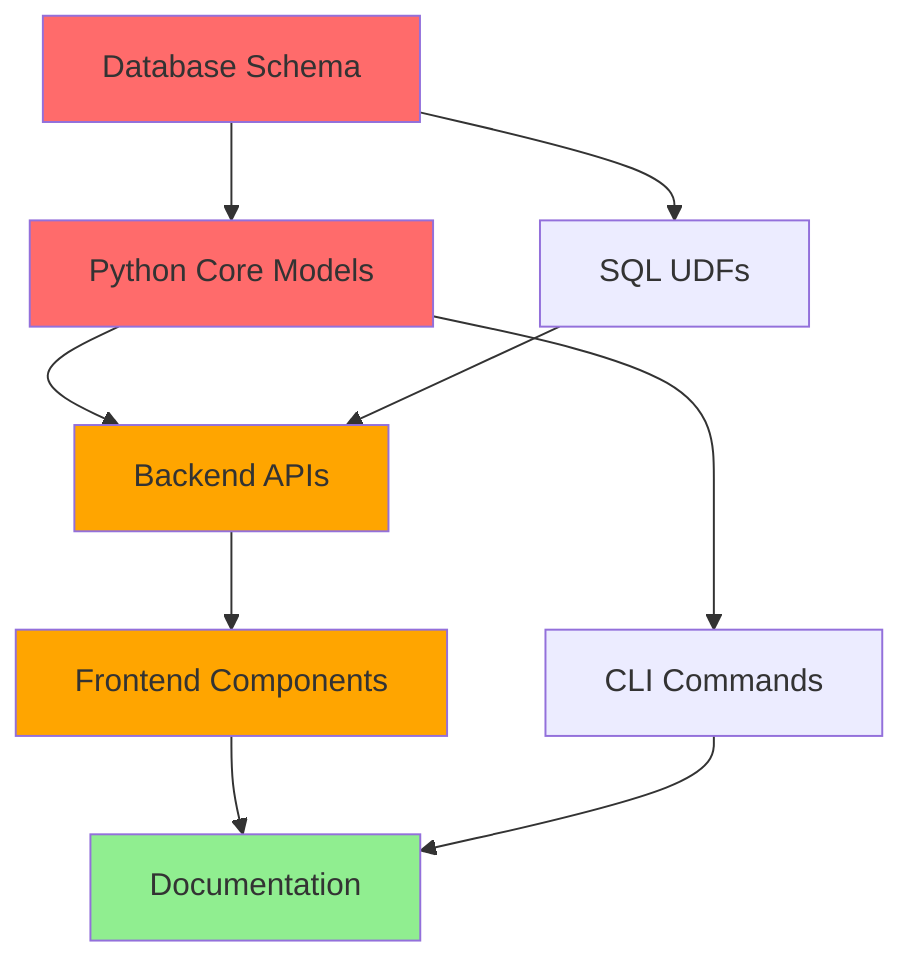

# RVBBIT Migration Plan
## Epic Rebranding: Windlass → RVBBIT

**Version:** 1.0
**Date:** 2025-12-25
**Status:** Planning Phase
**Breaking Changes:** YES (No backwards compatibility)

---

## Table of Contents

1. [Terminology Changes](#terminology-changes)
2. [Scope Summary](#scope-summary)
3. [Pre-Migration Checklist](#pre-migration-checklist)
4. [Staged Migration Plan](#staged-migration-plan)
5. [File-by-File Migration Matrix](#file-by-file-migration-matrix)
6. [Automated Migration Scripts](#automated-migration-scripts)
7. [Testing Strategy](#testing-strategy)
8. [Rollback Procedures](#rollback-procedures)
9. [Success Criteria](#success-criteria)

---

## Terminology Changes

### Core Rebranding

| Old Name | New Name | Scope | Examples |
|----------|----------|-------|----------|
| **Windlass** | **RVBBIT** | Framework name, CLI, package | `import windlass` → `import rvbbit` |
| **Phase** | **Cell** | DSL execution unit | `PhaseConfig` → `CellConfig`, `phase_name` → `cell_name` |
| **Tackle/Tools** | **Traits** | Tool system | `register_tackle()` → `register_trait()`, `tackle: ["sql"]` → `traits: ["sql"]` |
| **Soundings** | **Candidates** | Parallel execution | `SoundingsConfig` → `CandidatesConfig`, `sounding_index` → `candidate_index` |
| **Kit** | **Kit** | Pre-fab cells (UI only) | Low priority, mostly frontend |

### SQL UDF Changes

| Old Function | New Function | Usage |
|--------------|--------------|-------|
| `windlass_udf()` | `rvbbit()` | Simple LLM extraction in SQL queries |
| `windlass_cascade_udf()` | `rvbbit_run()` | Run complete cascade per database row |

### Environment Variables

All `WINDLASS_*` → `RVBBIT_*` (29+ variables)

Examples:
- `WINDLASS_ROOT` → `RVBBIT_ROOT`
- `WINDLASS_DEFAULT_MODEL` → `RVBBIT_DEFAULT_MODEL`
- `WINDLASS_USE_CLICKHOUSE_SERVER` → `RVBBIT_USE_CLICKHOUSE_SERVER`

---

## Scope Summary

### Impact by Numbers

| Category | Files Affected | Lines of Code | Complexity |
|----------|----------------|---------------|------------|
| **Python Backend** | ~120 files | ~30,000 lines | 🔴 Critical |
| **Frontend (React)** | ~219 files | ~25,000 lines | 🔴 Critical |
| **Documentation** | ~45 files | ~15,000 lines | 🟡 Medium |
| **Examples/Cascades** | ~100 files | ~5,000 lines | 🟡 Medium |
| **Database Schema** | 6 tables | N/A | 🔴 Critical |
| **Configuration** | ~10 files | ~500 lines | 🟡 Medium |
| **TOTAL** | **~500 files** | **~75,000 lines** | **🔴 EPIC** |

### Critical Dependencies



**Migration Order:** Database → Core Python → Backend APIs → Frontend → Documentation

---

## Pre-Migration Checklist

### 1. Backup Everything

```bash
# Create full backup branch
git checkout -b backup-before-rvbbit-migration
git push origin backup-before-rvbbit-migration

# Backup ClickHouse database
clickhouse-client --query "CREATE DATABASE windlass_backup AS windlass"

# Backup session databases
tar -czf session_dbs_backup.tar.gz session_dbs/

# Backup research databases
cp -r research_dbs/ research_dbs_backup/

# Export current state
windlass sql "SELECT * FROM all_data" --format json > pre_migration_data.json
```

### 2. Set Up Test Environment

```bash
# Create migration test branch
git checkout -b rvbbit-migration

# Set up isolated test environment
export RVBBIT_ROOT="$HOME/rvbbit-test-workspace"
mkdir -p "$RVBBIT_ROOT"

# Copy example data for testing
cp -r examples/ "$RVBBIT_ROOT/examples/"
cp -r tackle/ "$RVBBIT_ROOT/tackle/"
```

### 3. Create Migration Tools

See [Automated Migration Scripts](#automated-migration-scripts) section below.

### 4. Freeze Current Test Snapshots

```bash
# Run all cascades and freeze current behavior
for example in examples/*.yaml examples/*.json; do
    session_id="pre_migration_$(basename $example .yaml)"
    windlass "$example" --session "$session_id" --input '{}'
    windlass test freeze "$session_id" --name "$(basename $example)"
done

# Run existing test suite to establish baseline
pytest tests/ -v --json-report --json-report-file=pre_migration_test_report.json
```

### 5. Document Current State

```bash
# Generate file inventory
find . -type f -name "*.py" -o -name "*.js" -o -name "*.jsx" > pre_migration_inventory.txt

# Count references to old terminology
echo "=== Pre-Migration Reference Counts ===" > reference_counts.txt
echo "Windlass: $(rg -i 'windlass' --stats | grep matches)" >> reference_counts.txt
echo "Phase: $(rg -w 'phase' --stats | grep matches)" >> reference_counts.txt
echo "Tackle: $(rg -w 'tackle' --stats | grep matches)" >> reference_counts.txt
echo "Soundings: $(rg -w 'soundings' --stats | grep matches)" >> reference_counts.txt
```

---

## Staged Migration Plan

### Overview

We'll migrate in **6 stages**, each with validation checkpoints. Each stage is atomic and can be rolled back independently.

```
STAGE 1: Database Schema (1 day)
   ↓
STAGE 2: Python Package Structure (1 day)
   ↓
STAGE 3: Core Python Codebase (2-3 days)
   ↓
STAGE 4: Dashboard Backend (1-2 days)
   ↓
STAGE 5: Dashboard Frontend (3-4 days)
   ↓
STAGE 6: Documentation & Examples (1-2 days)
```

**Total Estimated Time:** 9-13 days

---

### STAGE 1: Database Schema Migration
**Duration:** 1 day
**Risk Level:** 🔴 Critical
**Rollback Complexity:** High

#### 1.1 Objectives

- Rename all database columns from old to new terminology
- Update indexes and constraints
- Preserve all existing data
- Validate data integrity

#### 1.2 Files to Modify

| File | Changes |
|------|---------|
| `windlass/windlass/schema.py` | Update table schemas (6 tables) |
| `windlass/windlass/unified_logs.py` | Update INSERT statements |
| `windlass/windlass/db_adapter.py` | Update query builders |

#### 1.3 Step-by-Step Execution

**Step 1.3.1: Update Schema Definitions**

Edit `/windlass/windlass/schema.py`:

```python
# BEFORE:
CREATE TABLE unified_logs (
    ...
    phase_name String,
    phase_json String,
    sounding_index Int32,
    winning_sounding_index Nullable(Int32),
    ...
)

# AFTER:
CREATE TABLE unified_logs (
    ...
    cell_name String,
    cell_json String,
    candidate_index Int32,
    winning_candidate_index Nullable(Int32),
    ...
)
```

**Column Rename Map:**
- `phase_name` → `cell_name`
- `phase_json` → `cell_json`
- `sounding_index` → `candidate_index`
- `winning_sounding_index` → `winning_candidate_index`
- `phase_start_time` → `cell_start_time`
- `phase_end_time` → `cell_end_time`

**Step 1.3.2: Create Migration SQL Script**

Create `migrations/001_rename_columns.sql`:

```sql
-- =====================================================
-- RVBBIT Migration: Rename Columns
-- =====================================================

-- 1. unified_logs table
ALTER TABLE unified_logs RENAME COLUMN phase_name TO cell_name;
ALTER TABLE unified_logs RENAME COLUMN phase_json TO cell_json;
ALTER TABLE unified_logs RENAME COLUMN sounding_index TO candidate_index;
ALTER TABLE unified_logs RENAME COLUMN winning_sounding_index TO winning_candidate_index;
ALTER TABLE unified_logs RENAME COLUMN phase_start_time TO cell_start_time;
ALTER TABLE unified_logs RENAME COLUMN phase_end_time TO cell_end_time;

-- Update index
ALTER TABLE unified_logs DROP INDEX IF EXISTS idx_phase_name;
ALTER TABLE unified_logs ADD INDEX idx_cell_name cell_name TYPE bloom_filter GRANULARITY 1;

-- 2. checkpoints table
ALTER TABLE checkpoints RENAME COLUMN phase_name TO cell_name;

-- 3. training_preferences table
ALTER TABLE training_preferences RENAME COLUMN phase_name TO cell_name;
ALTER TABLE training_preferences RENAME COLUMN sounding_index TO candidate_index;

-- 4. evaluations table
ALTER TABLE evaluations RENAME COLUMN phase_name TO cell_name;
ALTER TABLE evaluations RENAME COLUMN sounding_index TO candidate_index;
ALTER TABLE evaluations RENAME COLUMN sounding_factor TO candidate_factor;
ALTER TABLE evaluations RENAME COLUMN winning_sounding_index TO winning_candidate_index;

-- 5. context_cards table
ALTER TABLE context_cards RENAME COLUMN phase_name TO cell_name;

-- 6. arbiter_decisions table
ALTER TABLE arbiter_decisions RENAME COLUMN phase_name TO cell_name;
ALTER TABLE arbiter_decisions RENAME COLUMN sounding_index TO candidate_index;

-- Verify all changes
SELECT
    table AS table_name,
    name AS column_name,
    type AS column_type
FROM system.columns
WHERE database = 'windlass'
  AND table IN ('unified_logs', 'checkpoints', 'training_preferences',
                'evaluations', 'context_cards', 'arbiter_decisions')
ORDER BY table, position;
```

**Step 1.3.3: Execute Migration**

```bash
# Backup database first
clickhouse-client --query "CREATE DATABASE windlass_backup AS windlass"

# Run migration
clickhouse-client < migrations/001_rename_columns.sql

# Verify column names
clickhouse-client --query "DESCRIBE TABLE unified_logs"

# Test query with new column names
clickhouse-client --query "SELECT cell_name, candidate_index FROM unified_logs LIMIT 5"
```

**Step 1.3.4: Update Python Database Code**

Edit `windlass/windlass/unified_logs.py` - update all column references:

```python
# Find/replace in INSERT statements:
"phase_name" → "cell_name"
"phase_json" → "cell_json"
"sounding_index" → "candidate_index"
"winning_sounding_index" → "winning_candidate_index"
```

#### 1.4 Validation

```bash
# Run validation script
python migrations/validate_schema.py

# Expected output:
# ✓ All 6 tables migrated successfully
# ✓ All indexes recreated
# ✓ Row counts match (before: X, after: X)
# ✓ Sample queries return expected results
```

#### 1.5 Rollback Procedure

```sql
-- Reverse all column renames
ALTER TABLE unified_logs RENAME COLUMN cell_name TO phase_name;
ALTER TABLE unified_logs RENAME COLUMN cell_json TO phase_json;
-- ... (reverse all changes from migration script)

-- Or restore from backup
DROP DATABASE windlass;
CREATE DATABASE windlass AS windlass_backup;
```

---

### STAGE 2: Python Package Structure
**Duration:** 1 day
**Risk Level:** 🔴 Critical
**Rollback Complexity:** Medium

#### 2.1 Objectives

- Rename Python package from `windlass` to `rvbbit`
- Update all import statements
- Update entry points and CLI commands
- Update package metadata

#### 2.2 Files to Modify

| File | Changes |
|------|---------|
| `windlass/pyproject.toml` | Package name, entry point |
| `windlass/setup.py` (if exists) | Package configuration |
| Directory structure | Rename `windlass/windlass/` → `windlass/rvbbit/` |
| All Python files | Update imports |

#### 2.3 Step-by-Step Execution

**Step 2.3.1: Rename Package Directory**

```bash
cd windlass/

# Rename main package directory
mv windlass/ rvbbit/

# Update __init__.py to export with new names
# (We'll handle this in Stage 3)
```

**Step 2.3.2: Update pyproject.toml**

Edit `windlass/pyproject.toml`:

```toml
# BEFORE:
[project]
name = "windlass"
description = "Declarative agent framework for Python"

[project.scripts]
windlass = "windlass.cli:main"

# AFTER:
[project]
name = "rvbbit"
description = "RVBBIT: Declarative agent framework for Python"

[project.scripts]
rvbbit = "rvbbit.cli:main"
```

**Step 2.3.3: Update All Import Statements**

Run automated script:

```bash
# Find all Python files
find . -name "*.py" -type f > python_files.txt

# Update imports
python scripts/update_imports.py python_files.txt

# Script will change:
# from windlass import X → from rvbbit import X
# import windlass → import rvbbit
# from windlass.X import Y → from rvbbit.X import Y
```

**Step 2.3.4: Update CLI Entry Point**

Edit `rvbbit/cli.py`:

```python
# Update all help text and references
# Change 'windlass' command references to 'rvbbit'

def main():
    """RVBBIT CLI - Declarative agent framework."""
    # ... update all help strings
```

**Step 2.3.5: Reinstall Package**

```bash
cd windlass/  # Note: repo name stays "windlass" for now
pip uninstall windlass -y
pip install -e .

# Verify new command works
rvbbit --version
# Expected: "rvbbit version X.X.X"

# Old command should fail
windlass --version
# Expected: command not found
```

#### 2.4 Validation

```bash
# Test basic imports
python -c "import rvbbit; print(rvbbit.__version__)"

# Test CLI command
rvbbit --help

# Run simple cascade
rvbbit examples/simple_flow.json --input '{}'
```

#### 2.5 Rollback Procedure

```bash
# Rename back
mv rvbbit/ windlass/

# Revert pyproject.toml
git checkout pyproject.toml

# Reinstall
pip uninstall rvbbit -y
pip install -e .
```

---

### STAGE 3: Core Python Codebase
**Duration:** 2-3 days
**Risk Level:** 🔴 Critical
**Rollback Complexity:** Medium

#### 3.1 Objectives

- Rename Phase → Cell in all Python code
- Rename Tackle → Traits in all Python code
- Rename Soundings → Candidates in all Python code
- Update all class names, function names, variable names
- Update all docstrings and comments

#### 3.2 Files to Modify (Prioritized)

**Priority 1: Core Models (Day 1)**

| File | Primary Changes | Secondary Changes |
|------|----------------|-------------------|
| `rvbbit/cascade.py` | `PhaseConfig` → `CellConfig` | `phases` → `cells`, all docstrings |
| `rvbbit/runner.py` | `run_phase()` → `run_cell()` | Variable names, logging messages |
| `rvbbit/echo.py` | Phase references in state | Variable names |
| `rvbbit/deterministic.py` | `run_deterministic_phase()` → `run_deterministic_cell()` | All phase vars |

**Priority 2: Tool System (Day 1-2)**

| File | Primary Changes |
|------|----------------|
| `rvbbit/tackle.py` | `ToolRegistry` → `TraitRegistry`, `register_tackle()` → `register_trait()` |
| `rvbbit/tackle_manifest.py` | `Quartermaster` internal logic, "tackle" → "traits" |
| `rvbbit/tool_definitions.py` | "tackle" field references |
| `rvbbit/eddies/system.py` | `spawn_cascade()` tool logic |
| All `rvbbit/eddies/*.py` | Tool registration calls |

**Priority 3: Soundings System (Day 2)**

| File | Primary Changes |
|------|----------------|
| `rvbbit/cascade.py` | `SoundingsConfig` → `CandidatesConfig` |
| `rvbbit/runner.py` | `run_soundings()` → `run_candidates()` |
| `rvbbit/tracing.py` | `sounding_index` → `candidate_index` |
| `rvbbit/visualizer.py` | Mermaid graph labels |
| `rvbbit/arbiter.py` | Evaluation logic |

**Priority 4: Configuration & Utils (Day 2-3)**

| File | Primary Changes |
|------|----------------|
| `rvbbit/config.py` | All `WINDLASS_*` → `RVBBIT_*` env vars |
| `rvbbit/sql_tools/udf.py` | `windlass_udf()` → `rvbbit()`, `windlass_cascade_udf()` → `rvbbit_run()` |
| `rvbbit/server/postgres_server.py` | UDF registration |
| `rvbbit/client/sql_client.py` | `WindlassClient` → `RvbbitClient` |
| `rvbbit/cli.py` | Command help text |

**Priority 5: Supporting Modules (Day 3)**

| File | Changes |
|------|---------|
| `rvbbit/agent.py` | Variable names, logging |
| `rvbbit/unified_logs.py` | Column names (already done in Stage 1) |
| `rvbbit/visualizer.py` | Graph node labels |
| `rvbbit/human_ui.py` | UI component generation |
| `rvbbit/checkpoints.py` | Checkpoint field names |
| `rvbbit/prompts.py` | Template variable names |
| `rvbbit/events.py` | Event payload field names |
| `rvbbit/harbor.py` | Tool discovery |
| `rvbbit/utils.py` | Utility functions |

#### 3.3 Step-by-Step Execution

**Step 3.3.1: Create Comprehensive Find/Replace Map**

Create `migrations/term_mapping.json`:

```json
{
  "class_names": {
    "PhaseConfig": "CellConfig",
    "SoundingsConfig": "CandidatesConfig",
    "ToolRegistry": "TraitRegistry",
    "WindlassClient": "RvbbitClient"
  },
  "function_names": {
    "run_phase": "run_cell",
    "run_deterministic_phase": "run_deterministic_cell",
    "run_soundings": "run_candidates",
    "register_tackle": "register_trait",
    "get_tackle": "get_trait",
    "list_tackle": "list_traits",
    "windlass_udf": "rvbbit",
    "windlass_cascade_udf": "rvbbit_run"
  },
  "field_names": {
    "phases": "cells",
    "phase_name": "cell_name",
    "phase_json": "cell_json",
    "phase_config": "cell_config",
    "tackle": "traits",
    "soundings": "candidates",
    "sounding_index": "candidate_index",
    "sounding_factor": "candidate_factor",
    "winning_sounding_index": "winning_candidate_index"
  },
  "variable_patterns": {
    "phase": "cell",
    "phases": "cells",
    "current_phase": "current_cell",
    "next_phase": "next_cell",
    "tackle_name": "trait_name",
    "tackle_list": "trait_list",
    "sounding": "candidate",
    "soundings": "candidates"
  },
  "env_vars": {
    "WINDLASS_ROOT": "RVBBIT_ROOT",
    "WINDLASS_DATA_DIR": "RVBBIT_DATA_DIR",
    "WINDLASS_LOG_DIR": "RVBBIT_LOG_DIR",
    "WINDLASS_DEFAULT_MODEL": "RVBBIT_DEFAULT_MODEL"
  },
  "string_literals": {
    "Windlass": "RVBBIT",
    "windlass": "rvbbit"
  }
}
```

**Step 3.3.2: Automated Refactoring Script**

Create `scripts/refactor_python.py`:

```python
#!/usr/bin/env python3
"""
RVBBIT Migration: Automated Python refactoring
"""
import json
import re
from pathlib import Path
from typing import Dict, List

def load_mapping(mapping_file: str) -> Dict:
    with open(mapping_file) as f:
        return json.load(f)

def refactor_file(file_path: Path, mapping: Dict) -> bool:
    """Refactor a single Python file. Returns True if changed."""
    with open(file_path, 'r') as f:
        content = f.read()

    original_content = content

    # 1. Class names (must be whole word)
    for old, new in mapping['class_names'].items():
        content = re.sub(rf'\b{old}\b', new, content)

    # 2. Function names
    for old, new in mapping['function_names'].items():
        content = re.sub(rf'\b{old}\b', new, content)

    # 3. Field names in dicts/models (careful with quotes)
    for old, new in mapping['field_names'].items():
        # JSON-like: "phase_name": or 'phase_name':
        content = re.sub(rf'(["\']){old}\1\s*:', rf'\1{new}\1:', content)
        # Python kwargs: phase_name=
        content = re.sub(rf'\b{old}\s*=', f'{new}=', content)
        # Dict access: obj['phase_name']
        content = re.sub(rf'\[(["\']){old}\1\]', rf'[\1{new}\1]', content)

    # 4. Variable names (more careful - only in specific contexts)
    for old, new in mapping['variable_patterns'].items():
        # Variable assignments: phase = ...
        content = re.sub(rf'\b{old}\s*=', f'{new} =', content)
        # Function parameters: def foo(phase):
        content = re.sub(rf'\(\s*{old}\s*[,)]', rf'({new},', content)
        # for loops: for phase in phases:
        content = re.sub(rf'for\s+{old}\s+in\s+', f'for {new} in ', content)

    # 5. Environment variables
    for old, new in mapping['env_vars'].items():
        content = re.sub(rf'\b{old}\b', new, content)

    # 6. String literals (in docstrings, help text)
    for old, new in mapping['string_literals'].items():
        # Only in string literals
        content = re.sub(rf'(["\'].*?){old}(.*?["\'])', rf'\1{new}\2', content)

    # Write back if changed
    if content != original_content:
        with open(file_path, 'w') as f:
            f.write(content)
        return True
    return False

def main():
    mapping = load_mapping('migrations/term_mapping.json')

    # Process all Python files
    python_files = list(Path('rvbbit').rglob('*.py'))
    changed_files = []

    for file_path in python_files:
        print(f"Processing {file_path}...", end=' ')
        if refactor_file(file_path, mapping):
            print("✓ CHANGED")
            changed_files.append(file_path)
        else:
            print("- no changes")

    print(f"\n{'='*60}")
    print(f"Total files processed: {len(python_files)}")
    print(f"Files changed: {len(changed_files)}")
    print(f"{'='*60}")

    # Write manifest
    with open('migrations/stage3_changes.txt', 'w') as f:
        for path in changed_files:
            f.write(f"{path}\n")

if __name__ == '__main__':
    main()
```

**Step 3.3.3: Manual Review of Critical Files**

After automated refactoring, manually review these critical files:

1. `rvbbit/cascade.py` (1341 lines)
   - Check Pydantic model field names
   - Verify JSON schema validators
   - Update all docstrings

2. `rvbbit/runner.py`
   - Check execution flow logic
   - Verify context passing
   - Update logging messages

3. `rvbbit/sql_tools/udf.py`
   - SQL function names must match exactly
   - Update registration calls
   - Test query examples in docstrings

**Step 3.3.4: Update Config Environment Variables**

Edit `rvbbit/config.py` - use the automated script, then manually verify:

```python
# BEFORE:
WINDLASS_ROOT = os.getenv("WINDLASS_ROOT", os.getcwd())
WINDLASS_DATA_DIR = os.getenv("WINDLASS_DATA_DIR", ...)

# AFTER:
RVBBIT_ROOT = os.getenv("RVBBIT_ROOT", os.getcwd())
RVBBIT_DATA_DIR = os.getenv("RVBBIT_DATA_DIR", ...)
```

Create `.env.migration` template:

```bash
# Migration guide: Update these variables in your .env file
# Old → New

WINDLASS_ROOT → RVBBIT_ROOT
WINDLASS_DATA_DIR → RVBBIT_DATA_DIR
WINDLASS_LOG_DIR → RVBBIT_LOG_DIR
# ... (all 29 variables)
```

#### 3.4 Validation

```bash
# Run automated refactoring
python scripts/refactor_python.py

# Lint check
cd windlass/
python -m pylint rvbbit/ --errors-only

# Type check (if using mypy)
mypy rvbbit/

# Import check
python -c "from rvbbit.cascade import CellConfig; print('✓ CellConfig imported')"
python -c "from rvbbit.runner import WindlassRunner; print('✓ Runner imported')"

# Run basic cascade
export RVBBIT_ROOT="$PWD"
rvbbit examples/simple_flow.json --input '{"test": "data"}'
```

#### 3.5 Testing

```bash
# Run unit tests
pytest tests/ -v

# Check for remaining old terminology
rg -i "class.*Phase.*Config" rvbbit/  # Should find nothing
rg "def.*run_phase" rvbbit/  # Should find nothing
rg "register_tackle\(" rvbbit/  # Should find nothing
rg "\.phases" rvbbit/  # Check if context-appropriate (might be in JSON parsing)
```

#### 3.6 Rollback Procedure

```bash
# Revert all Python files
git checkout rvbbit/

# Or selective revert
cat migrations/stage3_changes.txt | xargs git checkout
```

---

### STAGE 4: Dashboard Backend
**Duration:** 1-2 days
**Risk Level:** 🟡 Medium
**Rollback Complexity:** Low

#### 4.1 Objectives

- Update all Flask API endpoints
- Update database queries to use new column names
- Update API response field names
- Maintain API contract for frontend

#### 4.2 Files to Modify

| Priority | File | Changes |
|----------|------|---------|
| 🔴 Critical | `dashboard/backend/app.py` | Main Flask app (266KB) - all endpoints |
| 🔴 Critical | `dashboard/backend/studio_api.py` | Phase-centric API routes |
| 🟡 High | `dashboard/backend/notebook_api.py` | Notebook cell operations |
| 🟡 High | `dashboard/backend/sextant_api.py` | Analytics queries |
| 🟡 High | `dashboard/backend/sql_server_api.py` | PostgreSQL server control |
| 🟢 Medium | `dashboard/backend/message_flow_api.py` | Message flow viz |
| 🟢 Medium | `dashboard/backend/artifacts_api.py` | Artifact management |
| 🟢 Medium | `dashboard/backend/cascade_execution_api.py` | Execution control |

#### 4.3 Step-by-Step Execution

**Step 4.3.1: Update Database Queries**

Create `scripts/update_backend_queries.py`:

```python
#!/usr/bin/env python3
"""Update SQL queries in Flask backend"""
import re
from pathlib import Path

# SQL column mappings
COLUMN_MAP = {
    'phase_name': 'cell_name',
    'phase_json': 'cell_json',
    'sounding_index': 'candidate_index',
    'winning_sounding_index': 'winning_candidate_index',
}

def update_sql_query(sql: str) -> str:
    """Update column names in SQL query"""
    for old, new in COLUMN_MAP.items():
        # SELECT phase_name → SELECT cell_name
        sql = re.sub(rf'\b{old}\b', new, sql)
    return sql

def update_file(file_path: Path):
    with open(file_path, 'r') as f:
        content = f.read()

    # Find SQL queries (in triple quotes or f-strings)
    # This is a simplified version - may need manual review
    updated = content
    for old, new in COLUMN_MAP.items():
        updated = re.sub(rf'(["\']).*?\b{old}\b.*?\1',
                        lambda m: m.group(0).replace(old, new),
                        updated)

    if updated != content:
        with open(file_path, 'w') as f:
            f.write(updated)
        print(f"✓ Updated {file_path}")

# Process all backend files
for file in Path('dashboard/backend').glob('*.py'):
    update_file(file)
```

**Step 4.3.2: Update API Response Fields**

Edit `dashboard/backend/app.py` and other API files:

```python
# BEFORE:
return jsonify({
    'phase_name': phase['name'],
    'tackle': phase['tackle'],
    'soundings': phase.get('soundings', [])
})

# AFTER:
return jsonify({
    'cell_name': cell['name'],
    'traits': cell['traits'],
    'candidates': cell.get('candidates', [])
})
```

**Critical API Endpoints to Update:**

1. `/api/sessions/<session_id>` - Session detail endpoint
2. `/api/phases/<session_id>` → `/api/cells/<session_id>` - Cell list
3. `/api/phase/<trace_id>` → `/api/cell/<trace_id>` - Cell detail
4. `/api/soundings/<session_id>` → `/api/candidates/<session_id>` - Candidates list
5. `/api/studio/timeline/<session_id>` - Timeline data
6. `/api/notebook/cells` - Notebook operations

**Step 4.3.3: Update Route Paths (Optional)**

Decide if you want to update API route paths:

```python
# Option A: Keep old routes for transition period
@app.route('/api/phase/<trace_id>')  # Deprecated
@app.route('/api/cell/<trace_id>')   # New
def get_cell_detail(trace_id):
    # ... same implementation

# Option B: Only new routes (breaking change)
@app.route('/api/cell/<trace_id>')
def get_cell_detail(trace_id):
    # ...
```

**Recommendation:** Option B (breaking change) since no backwards compat needed.

#### 4.4 Validation

```bash
# Start backend server
cd dashboard/backend
python app.py

# Test API endpoints
curl http://localhost:5001/api/sessions | jq '.[] | .cells'
curl http://localhost:5001/api/cells/<session_id> | jq '.[0].cell_name'

# Check for old terminology in responses
curl http://localhost:5001/api/sessions | jq . | grep -i "phase\|tackle\|sounding"
# Should return nothing

# Test SQL query endpoint
curl -X POST http://localhost:5001/api/sql/query \
  -H "Content-Type: application/json" \
  -d '{"query": "SELECT cell_name FROM all_data LIMIT 5"}'
```

#### 4.5 Testing

```bash
# Test cascade execution via API
curl -X POST http://localhost:5001/api/cascade/run \
  -H "Content-Type: application/json" \
  -d '{
    "cascade_path": "examples/simple_flow.json",
    "inputs": {"test": "data"}
  }'

# Verify SSE events use new terminology
curl http://localhost:5001/api/events/<session_id>
# Events should reference "cell", "traits", "candidates"
```

---

### STAGE 5: Dashboard Frontend
**Duration:** 3-4 days
**Risk Level:** 🟡 Medium
**Rollback Complexity:** Low

#### 5.1 Objectives

- Rename React components (Phase* → Cell*, Soundings* → Candidates*, Tackle* → Traits*)
- Update all API calls to use new endpoints
- Update UI text and labels
- Update state management (Zustand stores)

#### 5.2 Files to Modify (219 total)

**Priority 1: Component Renaming (Day 1)**

| Old Component | New Component | Location |
|---------------|---------------|----------|
| `PhaseAnatomyPanel.jsx` | `CellAnatomyPanel.jsx` | `studio/phase-anatomy/` |
| `PhaseCard.jsx` | `CellCard.jsx` | `studio/timeline/` |
| `PhaseDetailPanel.jsx` | `CellDetailPanel.jsx` | `studio/timeline/` |
| `PhaseNode.js` | `CellNode.js` | `playground/canvas/nodes/` |
| `PhaseSpeciesBadges.jsx` | `CellTypeBadges.jsx` | `components/` |
| `SoundingsExplorer.jsx` | `CandidatesExplorer.jsx` | `components/` |
| `SoundingComparison.jsx` | `CandidateComparison.jsx` | `components/` |
| `TacklePills.jsx` | `TraitPills.jsx` | `components/` |
| `TackleChips.jsx` | `TraitChips.jsx` | `components/` |

**Priority 2: State Management (Day 1-2)**

| File | Changes |
|------|---------|
| `stores/cascadeStore.js` | Zustand store - phase state → cell state |
| `stores/sessionStore.js` | Session data structure |
| `stores/playgroundStore.js` | Playground node state |

**Priority 3: API Client (Day 2)**

| File | Changes |
|------|---------|
| `api/cascadeApi.js` | API endpoints, response parsing |
| `api/sessionApi.js` | Session API calls |
| `api/notebookApi.js` | Notebook operations |

**Priority 4: UI Components (Day 2-3)**

| Category | File Count | Examples |
|----------|-----------|----------|
| Studio/Timeline | ~40 files | CascadeTimeline, PhaseBar, PhaseInnerDiagram |
| Playground | ~35 files | Canvas nodes, Phase explosion view |
| Workshop | ~25 files | PhaseBlock, PhasesRail, PhaseEditor |
| Shared Components | ~30 files | PhaseVoyage, TackleModal, SoundingsLayer |
| Utilities | ~15 files | phaseUtils.js, soundingsHelpers.js |

**Priority 5: Styles & Theme (Day 3)**

| File | Changes |
|------|---------|
| `*.css` files | Class names: `.phase-*` → `.cell-*`, `.soundings-*` → `.candidates-*` |
| Theme files | Color scheme variables, CSS custom properties |

**Priority 6: Package Metadata (Day 4)**

| File | Changes |
|------|---------|
| `package.json` | `"name": "windlass-debug-ui"` → `"name": "rvbbit-ui"` |
| `public/index.html` | Page title, meta tags |
| `public/manifest.json` | App name |

#### 5.3 Step-by-Step Execution

**Step 5.3.1: Component File Renaming**

Create `scripts/rename_frontend_components.sh`:

```bash
#!/bin/bash
# Rename frontend components

cd dashboard/frontend/src

# Phase → Cell components
find . -name "*Phase*.jsx" -o -name "*Phase*.js" | while read file; do
    new_file=$(echo "$file" | sed 's/Phase/Cell/g')
    git mv "$file" "$new_file"
    echo "Renamed: $file → $new_file"
done

# Soundings → Candidates components
find . -name "*Soundings*.jsx" -o -name "*Sounding*.jsx" | while read file; do
    new_file=$(echo "$file" | sed 's/Soundings/Candidates/g' | sed 's/Sounding/Candidate/g')
    git mv "$file" "$new_file"
    echo "Renamed: $file → $new_file"
done

# Tackle → Traits components
find . -name "*Tackle*.jsx" | while read file; do
    new_file=$(echo "$file" | sed 's/Tackle/Trait/g')
    git mv "$file" "$new_file"
    echo "Renamed: $file → $new_file"
done

# CSS files
find . -name "*Phase*.css" -o -name "*Soundings*.css" -o -name "*Tackle*.css" | while read file; do
    new_file=$(echo "$file" | sed 's/Phase/Cell/g' | sed 's/Soundings/Candidates/g' | sed 's/Tackle/Trait/g')
    git mv "$file" "$new_file"
    echo "Renamed: $file → $new_file"
done
```

**Step 5.3.2: Update Component Code**

Create `scripts/refactor_frontend.py`:

```python
#!/usr/bin/env python3
"""
RVBBIT Migration: Frontend refactoring
"""
import re
from pathlib import Path

# Component name mappings
COMPONENT_MAP = {
    'PhaseAnatomyPanel': 'CellAnatomyPanel',
    'PhaseCard': 'CellCard',
    'PhaseDetailPanel': 'CellDetailPanel',
    'PhaseNode': 'CellNode',
    'PhaseBar': 'CellBar',
    'PhaseInnerDiagram': 'CellInnerDiagram',
    'PhaseSpeciesBadges': 'CellTypeBadges',
    'SoundingsExplorer': 'CandidatesExplorer',
    'SoundingComparison': 'CandidateComparison',
    'SoundingLane': 'CandidateLane',
    'TacklePills': 'TraitPills',
    'TackleChips': 'TraitChips',
    'TackleModal': 'TraitModal',
}

# Variable/prop name mappings
PROP_MAP = {
    'phaseName': 'cellName',
    'phaseConfig': 'cellConfig',
    'phaseData': 'cellData',
    'currentPhase': 'currentCell',
    'selectedPhase': 'selectedCell',
    'tackleList': 'traitList',
    'soundingIndex': 'candidateIndex',
    'soundingFactor': 'candidateFactor',
}

# CSS class mappings
CSS_CLASS_MAP = {
    'phase-card': 'cell-card',
    'phase-anatomy': 'cell-anatomy',
    'phase-detail': 'cell-detail',
    'soundings-explorer': 'candidates-explorer',
    'sounding-lane': 'candidate-lane',
    'tackle-pill': 'trait-pill',
}

def refactor_jsx_file(file_path: Path) -> bool:
    """Refactor a JSX/JS file. Returns True if changed."""
    with open(file_path, 'r') as f:
        content = f.read()

    original = content

    # 1. Component names in imports/exports
    for old, new in COMPONENT_MAP.items():
        content = re.sub(rf'\b{old}\b', new, content)

    # 2. Props and variable names
    for old, new in PROP_MAP.items():
        content = re.sub(rf'\b{old}\b', new, content)

    # 3. CSS class names
    for old, new in CSS_CLASS_MAP.items():
        content = re.sub(rf'["\']({old})["\']', rf'"{new}"', content)

    # 4. API endpoint URLs
    content = re.sub(r'/api/phase/', '/api/cell/', content)
    content = re.sub(r'/api/phases/', '/api/cells/', content)
    content = re.sub(r'/api/soundings/', '/api/candidates/', content)

    # 5. String literals in UI text
    content = re.sub(r'>Phase</', '>Cell</', content)
    content = re.sub(r'>Phases</', '>Cells</', content)
    content = re.sub(r'>Soundings</', '>Candidates</', content)
    content = re.sub(r'>Tackle</', '>Traits</', content)

    if content != original:
        with open(file_path, 'w') as f:
            f.write(content)
        return True
    return False

def refactor_css_file(file_path: Path) -> bool:
    """Refactor a CSS file. Returns True if changed."""
    with open(file_path, 'r') as f:
        content = f.read()

    original = content

    # CSS class names
    for old, new in CSS_CLASS_MAP.items():
        content = re.sub(rf'\.{old}\b', f'.{new}', content)

    if content != original:
        with open(file_path, 'w') as f:
            f.write(content)
        return True
    return False

def main():
    src_dir = Path('dashboard/frontend/src')

    # Process JSX/JS files
    jsx_files = list(src_dir.rglob('*.jsx')) + list(src_dir.rglob('*.js'))
    jsx_changed = [f for f in jsx_files if refactor_jsx_file(f)]

    # Process CSS files
    css_files = list(src_dir.rglob('*.css'))
    css_changed = [f for f in css_files if refactor_css_file(f)]

    print(f"JSX/JS files changed: {len(jsx_changed)}/{len(jsx_files)}")
    print(f"CSS files changed: {len(css_changed)}/{len(css_files)}")

if __name__ == '__main__':
    main()
```

**Step 5.3.3: Update API Client**

Edit `dashboard/frontend/src/api/cascadeApi.js`:

```javascript
// BEFORE:
export const getPhaseDetail = async (traceId) => {
  const response = await fetch(`/api/phase/${traceId}`);
  return response.json();
};

export const getPhasesForSession = async (sessionId) => {
  const response = await fetch(`/api/phases/${sessionId}`);
  return response.json();
};

// AFTER:
export const getCellDetail = async (traceId) => {
  const response = await fetch(`/api/cell/${traceId}`);
  return response.json();
};

export const getCellsForSession = async (sessionId) => {
  const response = await fetch(`/api/cells/${sessionId}`);
  return response.json();
};
```

**Step 5.3.4: Update Zustand Stores**

Edit `dashboard/frontend/src/stores/cascadeStore.js`:

```javascript
// BEFORE:
const useCascadeStore = create((set) => ({
  selectedPhase: null,
  phases: [],
  soundings: [],

  setSelectedPhase: (phase) => set({ selectedPhase: phase }),
  setPhases: (phases) => set({ phases }),
  setSoundings: (soundings) => set({ soundings }),
}));

// AFTER:
const useCascadeStore = create((set) => ({
  selectedCell: null,
  cells: [],
  candidates: [],

  setSelectedCell: (cell) => set({ selectedCell: cell }),
  setCells: (cells) => set({ cells }),
  setCandidates: (candidates) => set({ candidates }),
}));
```

**Step 5.3.5: Update package.json**

Edit `dashboard/frontend/package.json`:

```json
{
  "name": "rvbbit-ui",
  "version": "2.0.0",
  "description": "RVBBIT Dashboard - Visual cascade builder and execution IDE",
  "main": "index.js",
  ...
}
```

#### 5.4 Validation

```bash
# Install dependencies
cd dashboard/frontend
npm install

# Build check
npm run build

# Expected: Successful build with no errors

# Start dev server
npm start

# Manual testing:
# 1. Navigate to http://localhost:3000
# 2. Check Studio timeline - should show "Cells" not "Phases"
# 3. Check Playground - should show "Traits" not "Tackle"
# 4. Check Candidates explorer - should show "Candidates" not "Soundings"
# 5. Run a cascade - verify execution works
```

#### 5.5 Testing Checklist

- [ ] Studio Timeline loads and displays cells correctly
- [ ] Cell detail panel shows correct data
- [ ] Candidates explorer shows parallel executions
- [ ] Playground canvas displays cells and traits
- [ ] Workshop editor allows adding traits
- [ ] SQL Query IDE works with new column names
- [ ] Session explorer shows correct session data
- [ ] All API calls return 200 status
- [ ] No console errors related to undefined props
- [ ] UI text uses new terminology everywhere

---

### STAGE 6: Documentation & Examples
**Duration:** 1-2 days
**Risk Level:** 🟢 Low
**Rollback Complexity:** Low

#### 6.1 Objectives

- Update all markdown documentation
- Update example cascade files
- Update README and main docs
- Update Docker and deployment configs

#### 6.2 Files to Modify

**Priority 1: Main Documentation (Day 1)**

| File | Size | Priority |
|------|------|----------|
| `CLAUDE.md` | Large | 🔴 Critical |
| `README.md` | 112KB | 🔴 Critical |
| `dashboard/CLAUDE.md` | Medium | 🟡 High |
| `docs/claude/*.md` | 16 files | 🟡 High |

**Priority 2: Example Files (Day 1-2)**

| Directory | File Count | Type |
|-----------|------------|------|
| `examples/` | ~60 files | YAML/JSON |
| `tackle/` → `traits/` | ~40 files | YAML/JSON |

**Priority 3: Configuration (Day 2)**

| File | Changes |
|------|---------|
| `docker-compose.yml` | Service names, env vars |
| `.env.example` | All variable names |
| `.github/workflows/*.yml` | CI/CD references |
| `Dockerfile` | Build instructions |

#### 6.3 Step-by-Step Execution

**Step 6.3.1: Update Main Documentation**

Edit `CLAUDE.md`:

```bash
# Use find/replace for bulk changes
sed -i 's/Windlass/RVBBIT/g' CLAUDE.md
sed -i 's/windlass/rvbbit/g' CLAUDE.md
sed -i 's/Phase/Cell/g' CLAUDE.md
sed -i 's/phase/cell/g' CLAUDE.md
sed -i 's/Tackle/Traits/g' CLAUDE.md
sed -i 's/tackle/traits/g' CLAUDE.md
sed -i 's/Soundings/Candidates/g' CLAUDE.md
sed -i 's/soundings/candidates/g' CLAUDE.md

# Manual review required for:
# - Code blocks with specific examples
# - Terminology explanations
# - Architecture diagrams
```

Key sections to update manually:

1. **Project Overview** - Framework description
2. **Installation & Setup** - Package name, CLI command
3. **Common Commands** - All `windlass` → `rvbbit`
4. **Core Architecture** - Cascade DSL examples
5. **Tool System** - "Tackle" → "Traits" terminology
6. **Terminology** section - Update nautical theme

**Step 6.3.2: Update Example Cascades**

All YAML/JSON files in `examples/`:

```bash
# Create backup
cp -r examples/ examples_backup/

# Automated update
find examples/ -name "*.yaml" -o -name "*.json" | while read file; do
    sed -i 's/"phases":/"cells":/g' "$file"
    sed -i 's/"phase_name":/"cell_name":/g' "$file"
    sed -i 's/"tackle":/"traits":/g' "$file"
    sed -i 's/"soundings":/"candidates":/g' "$file"
    echo "Updated: $file"
done
```

Example transformation:

```yaml
# BEFORE:
cascade_id: "example_flow"
phases:
  - name: "extract_data"
    instructions: "Extract key information"
    tackle: ["sql_data", "python_data"]
    soundings:
      factor: 3

# AFTER:
cascade_id: "example_flow"
cells:
  - name: "extract_data"
    instructions: "Extract key information"
    traits: ["sql_data", "python_data"]
    candidates:
      factor: 3
```

**Step 6.3.3: Rename tackle/ Directory**

```bash
# Move tackle/ to traits/
git mv tackle/ traits/

# Update all references in config.py
sed -i 's/TACKLE_DIR/TRAITS_DIR/g' rvbbit/config.py
sed -i 's/tackle\//traits\//g' rvbbit/config.py

# Update references in examples
find examples/ -type f -exec sed -i 's|tackle/|traits/|g' {} \;
```

**Step 6.3.4: Update Docker Configuration**

Edit `docker-compose.yml`:

```yaml
# BEFORE:
version: '3.8'
services:
  windlass-clickhouse:
    image: clickhouse/clickhouse-server
    container_name: windlass-clickhouse
    environment:
      CLICKHOUSE_DB: windlass

  windlass-app:
    build: .
    image: windlass:latest
    environment:
      - WINDLASS_ROOT=/app
      - WINDLASS_USE_CLICKHOUSE_SERVER=true

# AFTER:
version: '3.8'
services:
  rvbbit-clickhouse:
    image: clickhouse/clickhouse-server
    container_name: rvbbit-clickhouse
    environment:
      CLICKHOUSE_DB: rvbbit

  rvbbit-app:
    build: .
    image: rvbbit:latest
    environment:
      - RVBBIT_ROOT=/app
      - RVBBIT_USE_CLICKHOUSE_SERVER=true
```

Edit `.env.example`:

```bash
# BEFORE:
WINDLASS_ROOT=/path/to/workspace
WINDLASS_DEFAULT_MODEL=google/gemini-2.5-flash-lite
WINDLASS_DATA_DIR=./data
# ... all variables

# AFTER:
RVBBIT_ROOT=/path/to/workspace
RVBBIT_DEFAULT_MODEL=google/gemini-2.5-flash-lite
RVBBIT_DATA_DIR=./data
# ... all variables
```

**Step 6.3.5: Update Reference Documentation**

Process all files in `docs/claude/`:

```bash
cd docs/claude

# List of files to update
files=(
    "soundings-reference.md"
    "tools-reference.md"
    "context-reference.md"
    "validation-reference.md"
    "data-cascades-reference.md"
    "deterministic-reference.md"
    "playground-reference.md"
    "dashboard-reference.md"
    # ... all other md files
)

# Apply transformations
for file in "${files[@]}"; do
    # Soundings → Candidates
    sed -i 's/soundings-reference/candidates-reference/g' "$file"
    sed -i 's/Soundings/Candidates/g' "$file"
    sed -i 's/sounding/candidate/g' "$file"

    # Phase → Cell
    sed -i 's/Phase/Cell/g' "$file"
    sed -i 's/phase/cell/g' "$file"

    # Tackle → Traits
    sed -i 's/Tackle/Traits/g' "$file"
    sed -i 's/tackle/traits/g' "$file"

    echo "✓ Updated $file"
done

# Rename soundings-reference.md
git mv soundings-reference.md candidates-reference.md

# Update tools-reference.md → traits-reference.md
git mv tools-reference.md traits-reference.md
```

#### 6.4 Validation

```bash
# Check for remaining old terminology in docs
rg -i "windlass" *.md docs/**/*.md | grep -v "backup" | grep -v "migration"
# Should only find references in migration docs

rg -w "phase" *.md docs/**/*.md | grep -v "multi-phase" | grep -v "in-phase"
# Check context - should only be valid uses

# Validate YAML syntax
find examples/ -name "*.yaml" | while read f; do
    python -c "import yaml; yaml.safe_load(open('$f'))" && echo "✓ $f" || echo "✗ $f"
done

# Validate JSON syntax
find examples/ -name "*.json" | while read f; do
    python -c "import json; json.load(open('$f'))" && echo "✓ $f" || echo "✗ $f"
done
```

#### 6.5 Documentation Completeness Checklist

- [ ] CLAUDE.md updated with new terminology
- [ ] README.md updated (installation, usage examples)
- [ ] All docs/claude/*.md files updated
- [ ] All example cascades updated and validated
- [ ] tackle/ renamed to traits/
- [ ] Docker and deployment configs updated
- [ ] .env.example has all new variable names
- [ ] CI/CD workflows updated
- [ ] Migration guide created for users
- [ ] Changelog/release notes drafted

---

## File-by-File Migration Matrix

### Complete File List (500+ files)

**Python Backend (120 files)**

| File Path | Stage | Priority | Changes |
|-----------|-------|----------|---------|
| `rvbbit/cascade.py` | 3 | 🔴 | PhaseConfig → CellConfig, all field names |
| `rvbbit/runner.py` | 3 | 🔴 | run_phase() → run_cell(), execution logic |
| `rvbbit/tackle.py` | 3 | 🔴 | ToolRegistry → TraitRegistry |
| `rvbbit/config.py` | 3 | 🔴 | All WINDLASS_* → RVBBIT_* |
| `rvbbit/sql_tools/udf.py` | 3 | 🔴 | SQL UDF function names |
| `rvbbit/schema.py` | 1 | 🔴 | Database table schemas |
| `rvbbit/unified_logs.py` | 1 | 🔴 | Column names in INSERT queries |
| `rvbbit/deterministic.py` | 3 | 🟡 | Deterministic cell execution |
| `rvbbit/agent.py` | 3 | 🟡 | LLM wrapper, logging |
| `rvbbit/echo.py` | 3 | 🟡 | State container field names |
| ... (110 more files) | | | |

**Dashboard Backend (12 files)**

| File Path | Stage | Priority | Changes |
|-----------|-------|----------|---------|
| `dashboard/backend/app.py` | 4 | 🔴 | All API endpoints, 266KB file |
| `dashboard/backend/studio_api.py` | 4 | 🔴 | Cell-centric endpoints |
| `dashboard/backend/notebook_api.py` | 4 | 🟡 | Notebook cell operations |
| `dashboard/backend/sextant_api.py` | 4 | 🟡 | Analytics queries |
| `dashboard/backend/sql_server_api.py` | 4 | 🟡 | PostgreSQL server |
| ... (7 more files) | | | |

**Dashboard Frontend (219 files)**

| File Path | Stage | Priority | Rename To |
|-----------|-------|----------|-----------|
| `src/studio/phase-anatomy/PhaseAnatomyPanel.jsx` | 5 | 🔴 | `CellAnatomyPanel.jsx` |
| `src/studio/timeline/PhaseCard.jsx` | 5 | 🔴 | `CellCard.jsx` |
| `src/components/SoundingsExplorer.jsx` | 5 | 🔴 | `CandidatesExplorer.jsx` |
| `src/components/TacklePills.jsx` | 5 | 🔴 | `TraitPills.jsx` |
| `src/playground/canvas/nodes/PhaseNode.js` | 5 | 🔴 | `CellNode.js` |
| ... (214 more files) | | | |

**Documentation (45 files)**

| File Path | Stage | Priority | Changes |
|-----------|-------|----------|---------|
| `CLAUDE.md` | 6 | 🔴 | All terminology |
| `README.md` | 6 | 🔴 | 112KB - full rewrite |
| `docs/claude/soundings-reference.md` | 6 | 🟡 | Rename to candidates-reference.md |
| `docs/claude/tools-reference.md` | 6 | 🟡 | Rename to traits-reference.md |
| ... (41 more files) | | | |

**Examples & Cascades (100 files)**

| Directory | Stage | Changes |
|-----------|-------|---------|
| `examples/*.yaml` | 6 | phases → cells, tackle → traits |
| `examples/*.json` | 6 | All field names |
| `tackle/` → `traits/` | 6 | Directory rename + all files |

**Configuration (10 files)**

| File Path | Stage | Priority | Changes |
|-----------|-------|----------|---------|
| `pyproject.toml` | 2 | 🔴 | Package name, entry point |
| `.env.example` | 6 | 🔴 | All WINDLASS_* → RVBBIT_* |
| `docker-compose.yml` | 6 | 🟡 | Service names, env vars |
| `Dockerfile` | 6 | 🟡 | Build commands |
| `.github/workflows/*.yml` | 6 | 🟢 | CI/CD references |

---

## Automated Migration Scripts

### Script 1: Database Migration

File: `migrations/001_rename_columns.sql`

See [STAGE 1: Step 1.3.2](#step-132-create-migration-sql-script)

### Script 2: Python Package Refactoring

File: `scripts/refactor_python.py`

See [STAGE 3: Step 3.3.2](#step-332-automated-refactoring-script)

### Script 3: Frontend Component Renaming

File: `scripts/rename_frontend_components.sh`

See [STAGE 5: Step 5.3.1](#step-531-component-file-renaming)

### Script 4: Frontend Code Refactoring

File: `scripts/refactor_frontend.py`

See [STAGE 5: Step 5.3.2](#step-532-update-component-code)

### Script 5: Documentation Bulk Update

File: `scripts/update_docs.sh`

```bash
#!/bin/bash
# Bulk documentation update

set -e

echo "=== RVBBIT Documentation Migration ==="

# Function to update a file
update_file() {
    local file="$1"
    echo "Processing: $file"

    # Create backup
    cp "$file" "$file.backup"

    # Apply transformations
    sed -i 's/Windlass/RVBBIT/g' "$file"
    sed -i 's/windlass/rvbbit/g' "$file"
    sed -i 's/\bPhase\b/Cell/g' "$file"
    sed -i 's/\bphase\b/cell/g' "$file"
    sed -i 's/\bPhases\b/Cells/g' "$file"
    sed -i 's/\bphases\b/cells/g' "$file"
    sed -i 's/\bTackle\b/Traits/g' "$file"
    sed -i 's/\btackle\b/traits/g' "$file"
    sed -i 's/\bSoundings\b/Candidates/g' "$file"
    sed -i 's/\bsoundings\b/candidates/g' "$file"
    sed -i 's/\bSounding\b/Candidate/g' "$file"
    sed -i 's/\bsounding\b/candidate/g' "$file"

    # SQL UDFs
    sed -i 's/windlass_udf/rvbbit/g' "$file"
    sed -i 's/windlass_cascade_udf/rvbbit_run/g' "$file"

    # Environment variables
    sed -i 's/WINDLASS_/RVBBIT_/g' "$file"

    echo "✓ Updated: $file"
}

# Update markdown files
find . -name "*.md" -not -path "*/node_modules/*" -not -path "*/.git/*" | while read file; do
    update_file "$file"
done

# Rename specific reference docs
if [ -f "docs/claude/soundings-reference.md" ]; then
    git mv docs/claude/soundings-reference.md docs/claude/candidates-reference.md
    echo "✓ Renamed: soundings-reference.md → candidates-reference.md"
fi

if [ -f "docs/claude/tools-reference.md" ]; then
    git mv docs/claude/tools-reference.md docs/claude/traits-reference.md
    echo "✓ Renamed: tools-reference.md → traits-reference.md"
fi

echo "=== Documentation migration complete ==="
echo "Total files updated: $(find . -name "*.md.backup" | wc -l)"
echo "Backups created with .backup extension"
```

### Script 6: Example Cascade Migration

File: `scripts/migrate_examples.py`

```python
#!/usr/bin/env python3
"""
Migrate example cascade files to new terminology
"""
import json
import yaml
from pathlib import Path
from typing import Dict, Any

def migrate_cascade_dict(data: Dict[str, Any]) -> Dict[str, Any]:
    """Recursively migrate cascade dictionary"""
    if isinstance(data, dict):
        new_data = {}
        for key, value in data.items():
            # Rename keys
            new_key = key
            if key == 'phases':
                new_key = 'cells'
            elif key == 'phase_name':
                new_key = 'cell_name'
            elif key == 'tackle':
                new_key = 'traits'
            elif key == 'soundings':
                new_key = 'candidates'
            elif key == 'sounding_index':
                new_key = 'candidate_index'
            elif key == 'sounding_factor':
                new_key = 'candidate_factor'

            # Recursively migrate value
            new_data[new_key] = migrate_cascade_dict(value)
        return new_data

    elif isinstance(data, list):
        return [migrate_cascade_dict(item) for item in data]

    elif isinstance(data, str):
        # Update string references
        data = data.replace('phase_name', 'cell_name')
        data = data.replace('{{ state.phases', '{{ state.cells')
        data = data.replace('{{ outputs.', '{{ outputs.')
        # Be careful not to replace valid words like "in phase"
        return data

    else:
        return data

def migrate_yaml_file(file_path: Path):
    """Migrate a YAML cascade file"""
    with open(file_path, 'r') as f:
        data = yaml.safe_load(f)

    migrated = migrate_cascade_dict(data)

    with open(file_path, 'w') as f:
        yaml.dump(migrated, f, default_flow_style=False, sort_keys=False)

    print(f"✓ Migrated: {file_path}")

def migrate_json_file(file_path: Path):
    """Migrate a JSON cascade file"""
    with open(file_path, 'r') as f:
        data = json.load(f)

    migrated = migrate_cascade_dict(data)

    with open(file_path, 'w') as f:
        json.dump(migrated, f, indent=2)

    print(f"✓ Migrated: {file_path}")

def main():
    # Migrate examples/
    examples_dir = Path('examples')
    for yaml_file in examples_dir.glob('*.yaml'):
        migrate_yaml_file(yaml_file)
    for json_file in examples_dir.glob('*.json'):
        migrate_json_file(json_file)

    # Migrate tackle/ (soon to be traits/)
    tackle_dir = Path('tackle')
    if tackle_dir.exists():
        for yaml_file in tackle_dir.rglob('*.yaml'):
            migrate_yaml_file(yaml_file)
        for json_file in tackle_dir.rglob('*.json'):
            migrate_json_file(json_file)

    print("\n=== Migration complete ===")
    print(f"YAML files migrated: {len(list(examples_dir.glob('*.yaml')))}")
    print(f"JSON files migrated: {len(list(examples_dir.glob('*.json')))}")

if __name__ == '__main__':
    main()
```

### Script 7: Validation Script

File: `scripts/validate_migration.py`

```python
#!/usr/bin/env python3
"""
Validate RVBBIT migration completeness
"""
import re
import subprocess
from pathlib import Path
from typing import List, Tuple

class MigrationValidator:
    def __init__(self):
        self.errors = []
        self.warnings = []

    def check_old_terminology(self, directory: str, extensions: List[str]):
        """Check for remaining old terminology"""
        print(f"\n=== Checking {directory} for old terminology ===")

        old_terms = [
            (r'\bWindlass\b', 'Windlass (should be RVBBIT)'),
            (r'\bwindlass\b', 'windlass (should be rvbbit)'),
            (r'\bPhaseConfig\b', 'PhaseConfig (should be CellConfig)'),
            (r'\brun_phase\b', 'run_phase (should be run_cell)'),
            (r'\bregister_tackle\b', 'register_tackle (should be register_trait)'),
            (r'\bSoundingsConfig\b', 'SoundingsConfig (should be CandidatesConfig)'),
            (r'WINDLASS_', 'WINDLASS_* env var (should be RVBBIT_*)'),
        ]

        for ext in extensions:
            files = list(Path(directory).rglob(f'*.{ext}'))
            for file_path in files:
                # Skip backups and migrations
                if '.backup' in str(file_path) or 'migration' in str(file_path).lower():
                    continue

                with open(file_path, 'r', encoding='utf-8', errors='ignore') as f:
                    content = f.read()
                    line_num = 1
                    for line in content.split('\n'):
                        for pattern, description in old_terms:
                            if re.search(pattern, line):
                                self.errors.append(
                                    f"{file_path}:{line_num} - Found {description}: {line.strip()}"
                                )
                        line_num += 1

    def check_database_schema(self):
        """Verify database columns renamed"""
        print("\n=== Checking database schema ===")

        try:
            # Check if new columns exist
            result = subprocess.run(
                ['clickhouse-client', '--query', 'DESCRIBE TABLE unified_logs'],
                capture_output=True,
                text=True
            )

            if 'cell_name' not in result.stdout:
                self.errors.append("Database column 'cell_name' not found")
            if 'candidate_index' not in result.stdout:
                self.errors.append("Database column 'candidate_index' not found")

            # Check if old columns still exist
            if 'phase_name' in result.stdout:
                self.warnings.append("Old column 'phase_name' still exists")
            if 'sounding_index' in result.stdout:
                self.warnings.append("Old column 'sounding_index' still exists")

            print("✓ Database schema check complete")

        except Exception as e:
            self.warnings.append(f"Could not check database: {e}")

    def check_imports(self):
        """Verify Python imports work"""
        print("\n=== Checking Python imports ===")

        test_imports = [
            "from rvbbit.cascade import CellConfig",
            "from rvbbit.runner import WindlassRunner",
            "from rvbbit.tackle import TraitRegistry",
            "from rvbbit.config import RVBBIT_ROOT",
        ]

        for import_stmt in test_imports:
            try:
                exec(import_stmt)
                print(f"✓ {import_stmt}")
            except Exception as e:
                self.errors.append(f"Import failed: {import_stmt} - {e}")

    def check_cli_command(self):
        """Verify CLI command works"""
        print("\n=== Checking CLI command ===")

        try:
            result = subprocess.run(
                ['rvbbit', '--version'],
                capture_output=True,
                text=True
            )
            if result.returncode == 0:
                print(f"✓ CLI command works: {result.stdout.strip()}")
            else:
                self.errors.append(f"CLI command failed: {result.stderr}")
        except FileNotFoundError:
            self.errors.append("'rvbbit' command not found")

    def check_example_files(self):
        """Validate example cascade files"""
        print("\n=== Checking example files ===")

        import yaml
        import json

        yaml_files = list(Path('examples').glob('*.yaml'))
        json_files = list(Path('examples').glob('*.json'))

        for yaml_file in yaml_files:
            try:
                with open(yaml_file) as f:
                    data = yaml.safe_load(f)
                    if 'phases' in data:
                        self.errors.append(f"{yaml_file}: Still uses 'phases' instead of 'cells'")
                    if 'cells' not in data:
                        self.warnings.append(f"{yaml_file}: No 'cells' field found")
                print(f"✓ {yaml_file}")
            except Exception as e:
                self.errors.append(f"{yaml_file}: Parse error - {e}")

        for json_file in json_files:
            try:
                with open(json_file) as f:
                    data = json.load(f)
                    if 'phases' in data:
                        self.errors.append(f"{json_file}: Still uses 'phases' instead of 'cells'")
                print(f"✓ {json_file}")
            except Exception as e:
                self.errors.append(f"{json_file}: Parse error - {e}")

    def print_report(self):
        """Print validation report"""
        print("\n" + "="*60)
        print("MIGRATION VALIDATION REPORT")
        print("="*60)

        if self.errors:
            print(f"\n❌ ERRORS ({len(self.errors)}):")
            for error in self.errors:
                print(f"  - {error}")

        if self.warnings:
            print(f"\n⚠️  WARNINGS ({len(self.warnings)}):")
            for warning in self.warnings:
                print(f"  - {warning}")

        if not self.errors and not self.warnings:
            print("\n✅ All validation checks passed!")
            return True

        elif not self.errors:
            print("\n✅ No errors found (warnings can be ignored)")
            return True

        else:
            print(f"\n❌ Migration incomplete - {len(self.errors)} errors found")
            return False

def main():
    validator = MigrationValidator()

    # Run all checks
    validator.check_old_terminology('rvbbit', ['py'])
    validator.check_old_terminology('dashboard/backend', ['py'])
    validator.check_old_terminology('dashboard/frontend/src', ['js', 'jsx'])
    validator.check_database_schema()
    validator.check_imports()
    validator.check_cli_command()
    validator.check_example_files()

    # Print report
    success = validator.print_report()
    exit(0 if success else 1)

if __name__ == '__main__':
    main()
```

---

## Testing Strategy

### Test Plan Overview

Testing should happen **after each stage** to catch issues early.

### Stage 1: Database Schema Testing

```bash
# Test queries with new column names
clickhouse-client --query "SELECT cell_name, candidate_index FROM unified_logs LIMIT 10"

# Verify row counts match
clickhouse-client --query "SELECT COUNT(*) FROM unified_logs"
# Compare with pre-migration count

# Test indexes work
clickhouse-client --query "SELECT cell_name FROM unified_logs WHERE cell_name = 'test_cell' SETTINGS max_rows_to_read = 1000"

# Performance test
clickhouse-client --query "SELECT cell_name, COUNT(*) FROM unified_logs GROUP BY cell_name ORDER BY COUNT(*) DESC LIMIT 20" --time
```

### Stage 2: Package Structure Testing

```bash
# Test installation
pip uninstall windlass rvbbit -y
pip install -e .

# Test imports
python -c "import rvbbit; print('✓ Package imports')"
python -c "from rvbbit import __version__; print(f'✓ Version: {__version__}')"

# Test CLI
rvbbit --help
rvbbit --version

# Verify old command fails
which windlass
# Should not exist
```

### Stage 3: Core Python Testing

```bash
# Unit tests
pytest tests/ -v -k "not integration"

# Specific tests for renamed components
pytest tests/test_cascade.py -v
pytest tests/test_runner.py -v
pytest tests/test_sql_udf.py -v

# Integration tests
pytest tests/test_browser_integration.py -v
pytest tests/test_rag.py -v

# Run a simple cascade
rvbbit examples/simple_flow.json --input '{"test": "value"}'

# Verify SQL UDFs
rvbbit sql "SELECT rvbbit('Extract name', 'John Smith') as name"
```

### Stage 4: Dashboard Backend Testing

```bash
# Start backend
cd dashboard/backend
python app.py &
BACKEND_PID=$!

# Wait for startup
sleep 5

# Test API endpoints
curl http://localhost:5001/api/health
curl http://localhost:5001/api/sessions | jq '.[] | .cells'
curl http://localhost:5001/api/cells/<session_id>

# Test SQL endpoint
curl -X POST http://localhost:5001/api/sql/query \
  -H "Content-Type: application/json" \
  -d '{"query": "SELECT cell_name FROM all_data LIMIT 5"}'

# Kill backend
kill $BACKEND_PID
```

### Stage 5: Frontend Testing

```bash
# Install and build
cd dashboard/frontend
npm install
npm run build

# Lint
npm run lint

# Start dev server
npm start &
FRONTEND_PID=$!

# Manual testing checklist:
# - Navigate to http://localhost:3000
# - Check all pages load
# - Verify terminology in UI
# - Run a cascade
# - Check console for errors

# Kill frontend
kill $FRONTEND_PID
```

### Stage 6: Documentation Testing

```bash
# Validate YAML syntax
find examples/ -name "*.yaml" | xargs python -c "
import sys, yaml
for f in sys.argv[1:]:
    try:
        yaml.safe_load(open(f))
        print(f'✓ {f}')
    except Exception as e:
        print(f'✗ {f}: {e}')
        sys.exit(1)
"

# Validate JSON syntax
find examples/ -name "*.json" | xargs python -c "
import sys, json
for f in sys.argv[1:]:
    try:
        json.load(open(f))
        print(f'✓ {f}')
    except Exception as e:
        print(f'✗ {f}: {e}')
        sys.exit(1)
"

# Check for broken links in docs (optional)
markdown-link-check README.md
markdown-link-check CLAUDE.md
```

### End-to-End Integration Tests

After all stages complete:

```bash
# Full workflow test
rvbbit examples/soundings_flow.json --input '{"data": "test"}' --session e2e_test_001

# Verify session in database
rvbbit sql "SELECT * FROM all_data WHERE session_id = 'e2e_test_001'"

# Check dashboard shows session
curl http://localhost:5001/api/sessions/e2e_test_001 | jq '.cells'

# Test snapshot system
rvbbit test freeze e2e_test_001 --name e2e_migration_test
rvbbit test replay e2e_migration_test

# Run full test suite
pytest tests/ -v --maxfail=5
```

### Performance Testing

```bash
# Benchmark cascade execution
time rvbbit examples/complex_flow.json --input '{}'

# Database query performance
rvbbit sql "SELECT cell_name, COUNT(*) FROM all_data GROUP BY cell_name" --timing

# Memory profiling (optional)
python -m memory_profiler rvbbit/cli.py examples/simple_flow.json
```

---

## Rollback Procedures

### Emergency Rollback (All Stages)

If critical issues discovered:

```bash
# 1. Stop all services
pkill -f "python.*app.py"
pkill -f "npm start"

# 2. Checkout pre-migration code
git checkout backup-before-rvbbit-migration

# 3. Restore database from backup
clickhouse-client --query "DROP DATABASE windlass"
clickhouse-client --query "CREATE DATABASE windlass AS windlass_backup"

# 4. Reinstall old package
pip uninstall rvbbit -y
pip install -e .

# 5. Verify old system works
windlass examples/simple_flow.json --input '{}'
```

### Stage-Specific Rollback

**Stage 1: Database**

```sql
-- Restore from backup
DROP DATABASE windlass;
CREATE DATABASE windlass AS windlass_backup;
```

**Stage 2: Python Package**

```bash
mv rvbbit/ windlass/
git checkout pyproject.toml
pip uninstall rvbbit -y
pip install -e .
```

**Stage 3: Core Python**

```bash
cat migrations/stage3_changes.txt | xargs git checkout
```

**Stage 4: Dashboard Backend**

```bash
git checkout dashboard/backend/
```

**Stage 5: Frontend**

```bash
git checkout dashboard/frontend/
cd dashboard/frontend
npm install
```

**Stage 6: Documentation**

```bash
# Restore from .backup files
find . -name "*.backup" | while read backup; do
    original="${backup%.backup}"
    mv "$backup" "$original"
done
```

---

## Success Criteria

### Stage 1: Database Schema ✅

- [ ] All 6 tables have renamed columns
- [ ] Indexes recreated successfully
- [ ] Row counts match pre-migration
- [ ] Sample queries return expected results
- [ ] No performance degradation

### Stage 2: Python Package ✅

- [ ] Package renamed to `rvbbit`
- [ ] CLI command `rvbbit` works
- [ ] Old command `windlass` does not exist
- [ ] Basic imports work
- [ ] Simple cascade executes

### Stage 3: Core Python ✅

- [ ] All class names updated (PhaseConfig → CellConfig, etc.)
- [ ] All function names updated
- [ ] All field names updated
- [ ] Environment variables renamed
- [ ] SQL UDFs renamed and registered
- [ ] No old terminology in Python code
- [ ] Unit tests pass
- [ ] Integration tests pass

### Stage 4: Dashboard Backend ✅

- [ ] All API endpoints updated
- [ ] Database queries use new column names
- [ ] API responses use new field names
- [ ] No old terminology in API responses
- [ ] All endpoints return 200 status
- [ ] SSE events use new terminology

### Stage 5: Frontend ✅

- [ ] All components renamed
- [ ] All API calls updated
- [ ] UI text uses new terminology
- [ ] State management updated
- [ ] Build succeeds with no errors
- [ ] No console errors
- [ ] Manual testing checklist complete

### Stage 6: Documentation ✅

- [ ] CLAUDE.md updated
- [ ] README.md updated
- [ ] All docs/claude/*.md updated
- [ ] All example files migrated
- [ ] tackle/ renamed to traits/
- [ ] Docker configs updated
- [ ] .env.example updated
- [ ] No old terminology in docs (except migration guides)

### Overall Project ✅

- [ ] All 6 stages complete
- [ ] Full test suite passes
- [ ] End-to-end integration tests pass
- [ ] Performance benchmarks acceptable
- [ ] Documentation complete
- [ ] Migration guide published
- [ ] Release notes drafted
- [ ] Backup procedures validated
- [ ] Rollback procedures tested

---

## Migration Checklist

Print this and check off as you go:

### Pre-Migration

- [ ] Create backup branch
- [ ] Backup ClickHouse database
- [ ] Backup session databases
- [ ] Export current state
- [ ] Set up test environment
- [ ] Create migration scripts
- [ ] Freeze test snapshots
- [ ] Document current state

### Stage 1: Database Schema

- [ ] Update schema.py
- [ ] Create migration SQL script
- [ ] Execute database migration
- [ ] Verify column renames
- [ ] Update unified_logs.py
- [ ] Run validation queries
- [ ] Test rollback procedure

### Stage 2: Python Package

- [ ] Rename package directory
- [ ] Update pyproject.toml
- [ ] Update all imports
- [ ] Update CLI entry point
- [ ] Reinstall package
- [ ] Test `rvbbit` command
- [ ] Verify old command removed

### Stage 3: Core Python

- [ ] Create term mapping
- [ ] Run automated refactoring
- [ ] Manual review critical files
- [ ] Update environment variables
- [ ] Update SQL UDFs
- [ ] Run lint checks
- [ ] Run unit tests
- [ ] Run integration tests

### Stage 4: Dashboard Backend

- [ ] Update database queries
- [ ] Update API response fields
- [ ] Update route paths
- [ ] Test all endpoints
- [ ] Check API responses
- [ ] Test SSE events

### Stage 5: Frontend

- [ ] Rename component files
- [ ] Update component code
- [ ] Update API client
- [ ] Update state management
- [ ] Update package.json
- [ ] Build successfully
- [ ] Manual testing
- [ ] No console errors

### Stage 6: Documentation

- [ ] Update CLAUDE.md
- [ ] Update README.md
- [ ] Update reference docs
- [ ] Migrate example files
- [ ] Rename tackle/ to traits/
- [ ] Update Docker configs
- [ ] Update .env.example
- [ ] Validate YAML/JSON syntax

### Post-Migration

- [ ] Run full test suite
- [ ] E2E integration tests
- [ ] Performance benchmarks
- [ ] Documentation review
- [ ] Migration guide created
- [ ] Release notes drafted
- [ ] Test rollback procedure
- [ ] Announce migration complete

---

## Timeline & Resources

### Recommended Timeline

| Stage | Duration | Team | Dependencies |
|-------|----------|------|--------------|
| Pre-Migration | 1 day | All | - |
| Stage 1 | 1 day | Backend, DB | Pre-Migration |
| Stage 2 | 1 day | Backend | Stage 1 |
| Stage 3 | 2-3 days | Backend | Stage 2 |
| Stage 4 | 1-2 days | Backend, API | Stage 3 |
| Stage 5 | 3-4 days | Frontend | Stage 4 |
| Stage 6 | 1-2 days | Docs | Stage 5 |
| Testing | 2-3 days | All | All Stages |
| **Total** | **12-17 days** | | |

### Resource Requirements

**People:**
- 1-2 Backend engineers (Python)
- 1-2 Frontend engineers (React)
- 1 Database administrator (ClickHouse)
- 1 Documentation writer
- 1 QA tester

**Tools:**
- Git (version control)
- Python 3.9+ (backend)
- Node.js 16+ (frontend)
- ClickHouse client (database)
- pytest (testing)
- ripgrep/rg (search)

**Infrastructure:**
- Development environment
- Test database instance
- Staging environment (optional)
- CI/CD pipeline

---

## Risk Matrix

| Risk | Probability | Impact | Mitigation |
|------|-------------|--------|------------|
| Database migration fails | Low | Critical | Backup + rollback procedure |
| Data loss during migration | Low | Critical | Multiple backups, validation |
| Breaking API changes | Medium | High | Comprehensive testing, staged rollout |
| Import errors after rename | Medium | High | Automated import updates, testing |
| Frontend build failures | Medium | Medium | Incremental changes, frequent builds |
| Documentation incomplete | Medium | Medium | Checklist, peer review |
| Performance degradation | Low | Medium | Benchmarking, optimization |
| User confusion | High | Low | Migration guide, clear communication |

---

## Next Steps

1. **Review this plan** with all stakeholders
2. **Schedule migration window** (12-17 days)
3. **Assign team members** to each stage
4. **Create migration scripts** from templates above
5. **Set up test environment**
6. **Begin Stage 1** when ready

---

## Questions & Decisions Needed

**Before starting:**

1. Should we keep old API routes during transition? (Recommendation: No, breaking change is fine)
2. Should we rename the GitHub repo? (Currently `windlass` → `rvbbit`?)
3. Should we support both UDF names temporarily? (Recommendation: No, clean break)
4. Should we rename `cascades/` directory? (Recommendation: Keep it, generic enough)
5. Should examples/ become demonstrations/ or samples/? (Recommendation: Keep `examples/`)
6. Should we create a v2.0.0 release? (Recommendation: Yes, breaking changes)

**Docker/Deployment:**

7. Should we keep ClickHouse database name as `windlass` or rename to `rvbbit`? (Recommendation: Rename)
8. Should we update Docker image names? (Recommendation: Yes, `rvbbit:latest`)

---

**END OF MIGRATION PLAN**

Good luck with the rebranding! 🚀

---

*This document was created on 2025-12-25. Update version number and date as plan evolves.*
