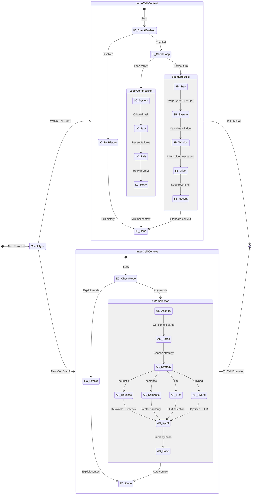

# Auto-Context Deep Dive


A comprehensive guide to LARS's intelligent context management system.
  Understand exactly how context is selected, compressed, and optimized at every level.


> **INFO: Key Design Principle**
>
> 
> **NEVER drop information** - originals are always stored and available for injection.
>     Auto-context compresses what the LLM *sees*, not what LARS *stores*.
>     This means you can always retrieve full history if needed. A message that might get culled in one turn might be fully re-included in a subsequent turn if it seems relevant.
> 

On This Page
- [System Overview](#overview)
- [Decision Flow Diagram](#decision-flow)
- [Intra-Cell Context (Within a Cell)](#intra-cell)
- [Inter-Cell Context (Between Cells)](#inter-cell)
- [Configuration Reference](#configuration)
- [Token Savings Analysis](#token-savings)
- [Example Cascades](#examples)


## System Overview


LARS's auto-context system operates at two distinct levels, each solving different problems:


#### Intra-Cell (Within)


Manages context **within a single cell's turn loop**.
      Prevents context explosion during long-running research, iteration, or tool-heavy cells.
- Sliding window for recent turns
- Observation masking for old tool results
- Loop compression for retry attempts


**Typical savings:** 50-80%


#### Inter-Cell (Between)


Controls what context **flows from prior cells** to the current cell.
      Uses intelligent selection instead of manual `context.from` configuration.
- Anchors (always-included context)
- Multiple selection strategies
- Token budget enforcement


**Typical savings:** 40-70%

## Decision Flow Diagram


This diagram shows exactly what happens when auto-context processes a new turn or cell execution.
  The system first determines whether this is an intra-cell operation (within a turn loop) or 
  inter-cell (starting a new cell), then applies the appropriate context building strategy.




> **TIP: Diagram Legend**
>
> 
> **Intra-Cell Path:** For each turn within a cell, context is either passed through fully (disabled),
>   compressed via loop compression (for retries), or built with sliding window + masking (standard).
> 
> **Inter-Cell Path:** When starting a new cell, context is either explicitly configured or
>   auto-selected using one of four strategies. Anchors (input, outputs, callouts, errors) are always included.
>   Context cards contain hash references, summaries, keywords, and embeddings for efficient selection.
> 


## Intra-Cell Context (Within a Cell)


Intra-cell context management prevents context explosion during long-running cells.
  It uses a **tiered approach** that progressively compresses older messages.

### The Three Tiers


| Tier                      | Messages                  | Treatment                | Why                                                        |
|---------------------------|---------------------------|--------------------------|------------------------------------------------------------|
| **Tier 0**
System         | System prompt(s)          | Always preserved in full | Core instructions must never be lost                       |
| **Tier 1**
Recent Window  | Last N turns (default: 5) | Full fidelity            | Recent context is most relevant for current work           |
| **Tier 2**
Older Messages | Beyond window             | Masked/Compressed        | Historical details rarely needed, but references available |


### Window Calculation


The sliding window is calculated based on turns, not individual messages. Since each turn 
  typically involves ~3 messages (user prompt, assistant response with tool calls, tool results), 
  the window boundary is: `window * 3` messages from the end.

```window boundary logic
# From auto_context.py:200-204
window_messages = self.config.window * 3  # ~3 msgs per turn
window_start = max(0, len(messages) - window_messages)

older_messages = messages[:window_start]   # Apply masking
recent_messages = messages[window_start:]  # Full fidelity
```

### Observation Masking


When tool results are older than the window, they're replaced with reference placeholders.
  The original content is still stored and can be retrieved by hash if needed.

```before masking (2000 chars)
{
  "role": "tool",
  "tool_call_id": "call_abc123",
  "content": "{"data": [...2000 chars of JSON...]}"
}
```

```after masking (~50 chars)
{
  "role": "tool", 
  "tool_call_id": "call_abc123",
  "content": "[Tool structured result, 2000 chars, ref=a1b2c3d4]",
  "_masked": true,
  "_original_hash": "a1b2c3d4"
}
```


> **TIP: Hash References**
>
> 
> The `ref=a1b2c3d4` hash allows retrieval of the original content if needed.
>     This is how auto-context maintains the "never drop" principle - the data exists,
>     the LLM just doesn't see it unless it's relevant.
> 


### Message Processing Rules


For each message outside the recent window, the following rules are applied in order:


| Condition                        | Action                      | Rationale                                        |
|----------------------------------|-----------------------------|--------------------------------------------------|
| Contains error keywords          | **Preserve fully**          | Errors are always important for debugging        |
| Tool result > min_masked_size    | Mask with hash placeholder  | Large results dominate token budget              |
| Tool result <= min_masked_size   | Preserve fully              | Small results aren't worth masking overhead      |
| Assistant with tool_calls        | Mask to tool list + preview | Tool call JSON is verbose but tool names helpful |
| Assistant reasoning > 2000 chars | Truncate to 2000 chars      | Very long reasoning rarely needed in full        |
| User message                     | Preserve fully              | User instructions are always important           |


### Loop Compression


For `loop_until` retry attempts, a radically minimal context is built.
  The insight: retry attempts don't need the full conversation history - they need to know
  what they're trying to do and why previous attempts failed.

```loop context structure (attempt #4)
# Only these 4 components are included:

System: You are a data analyst...

User: [Original Task]
Generate a report analyzing Q4 sales data with charts...

Assistant: [Attempt #2]
Here is my analysis...

User: [Validation Failed]
Missing required "summary" section in output

Assistant: [Attempt #3]
Here is the corrected report...

User: [Validation Failed]
Chart data doesn't match the numbers in the text

User: Please try again (Attempt #4). Address the validation issues noted above.
```


This achieves **70-80% token reduction** for loop_until scenarios, where
  traditional approaches would accumulate all attempts at full fidelity.

## Inter-Cell Context (Between Cells)


When a cell starts, it may need context from prior cells. Instead of manually specifying
  `context: {from: [cell_a, cell_b]}`, auto-context can intelligently select
  what's relevant.

### Anchors: Always-Included Context


Anchors are messages that are **always included** regardless of selection strategy.
  They represent critical context that should never be omitted:


| Anchor Type | What It Includes                   | Why It's Anchored                         |
|-------------|------------------------------------|-------------------------------------------|
| `input`     | Original cascade input             | The task/request never becomes irrelevant |
| `output`    | Final outputs from specified cells | Completed work should inform next steps   |
| `callouts`  | User-marked important messages     | Explicitly flagged as important           |
| `errors`    | Error messages (limit: 5)          | Errors inform debugging and avoidance     |


```anchor configuration
context:
  mode: auto
  anchors:
    window: 3              # Last N turns from current cell
    from_cells: [previous]  # Which cells to get outputs from
    include:               # What to anchor
      - output
      - callouts  
      - input
      - errors
```

### Context Cards


Every message logged during execution gets a "context card" stored in the database.
  These cards contain metadata that enables fast selection without loading full content:


| Field               | Purpose                                   |
|---------------------|-------------------------------------------|
| `content_hash`      | SHA256 reference to original content      |
| `summary`           | LLM-generated summary (~100 chars)        |
| `keywords`          | Extracted keywords for heuristic matching |
| `embedding`         | Vector embedding for semantic search      |
| `estimated_tokens`  | Token count for budget enforcement        |
| `is_callout`        | Whether user marked as important          |
| `message_timestamp` | For recency scoring                       |


### Selection Strategies


#### Heuristic Selection (Fast, No LLM)


Scores takes using keyword overlap, recency, and callout status.
  Good for cost-sensitive workloads where approximate selection is acceptable.

```heuristic scoring formula
score = 0.0
score += keyword_overlap * keyword_weight * 10    # How many keywords match
score += recency_score * recency_weight * 50      # Newer = higher (0-1)
score += callout_weight * 100 if is_callout       # Big boost for callouts
score += 5 if role == "assistant"                 # Slight preference for outputs
```

#### Semantic Selection (Vector Search)


Embeds the current task instructions and finds similar context cards using vector similarity.
  Good when keyword overlap doesn't capture semantic relationships.

```semantic selection flow
# 1. Embed current task
task_embedding = embed(cell.instructions[:1000])

# 2. Search context cards by similarity
results = db.search_context_cards_semantic(
    session_id=session_id,
    query_embedding=task_embedding,
    limit=max_messages,
    similarity_threshold=0.5
)

# 3. Select until budget exhausted
selected = []
for r in results:
    if tokens_used + r.tokens <= budget:
        selected.append(r.content_hash)
```

#### LLM Selection (Most Accurate)


A cheap, fast model scans a "menu" of context summaries and picks relevant ones.
  Most accurate but adds a small LLM call cost.

```llm selection menu format
[a1b2c3d4] assistant (research, ~500 tok): Found 3 relevant papers on...
[e5f6g7h8] user (research, ~100 tok): Can you also check industry reports?
[i9j0k1l2] assistant (analyze, ~800 tok): Key findings show 40% improvement...
```


The context selector model (default: `gemini-2.5-flash-lite`) returns JSON:
  `{"selected": ["a1b2c3d4", "i9j0k1l2"], "reasoning": "These contain the research findings..."}`

#### Hybrid Selection (Recommended)


Combines heuristic prefiltering with LLM final selection for the best balance of 
  accuracy and cost:
1. **Prefilter:** Heuristic selects top takes at 2x the token budget
2. **Skip LLM:** If ≤5 takes remain, use heuristic result directly
3. **LLM Final:** Otherwise, LLM picks from the prefiltered pool


### Original Content Injection


After selection, the selected content hashes are used to retrieve the full original
  messages from `unified_logs`. This ensures the LLM receives complete,
  unmodified context even though selection was based on summaries.

## Configuration Reference


### Intra-Cell Configuration


```cell-level intra-context
cells:
  - name: research
    instructions: "Research the topic thoroughly"
    intra_context:
      enabled: true
      window: 5                     # Last N turns at full fidelity
      mask_observations_after: 3   # Mask tool results older than N turns
      compress_loops: true          # Use minimal context for retries
      loop_history_limit: 3        # Max prior attempts to include
      preserve_reasoning: true      # Keep assistant msgs without tools
      preserve_errors: true         # Always keep error messages
      min_masked_size: 200         # Don't mask results under N chars
```

### Cascade-Level Defaults


```cascade-level auto-context
cascade_id: my_research_flow
auto_context:
  intra_cell:
    enabled: true
    window: 5
    compress_loops: true
  inter_cell:
    enabled: true
    selection:
      strategy: hybrid
      max_tokens: 30000

cells:
  - name: research
    # Inherits cascade-level auto_context settings
    
  - name: synthesis
    intra_context:
      window: 10  # Cell-level override
```

### Inter-Cell Configuration


```auto selection configuration
cells:
  - name: synthesis
    context:
      mode: auto                    # Enable auto-selection
      anchors:
        from_cells: [previous]       # Always include outputs from
        include: [output, callouts, input]
      selection:
        strategy: hybrid            # heuristic, semantic, llm, hybrid
        max_tokens: 30000            # Token budget for selected context
        max_messages: 50             # Max messages to select
        recency_weight: 0.3         # Weight for heuristic recency
        keyword_weight: 0.4         # Weight for keyword overlap
        callout_weight: 0.3         # Weight for callout boost
        similarity_threshold: 0.5   # Min similarity for semantic
```

## Token Savings Analysis


Real-world token savings depend on workload characteristics. Here are typical scenarios:


| Scenario                    | Without Auto-Context | With Auto-Context | Savings |
|-----------------------------|----------------------|-------------------|---------|
| 15-turn research cell       | ~170K tokens         | ~65K tokens       | **62%** |
| 10-iteration loop_until     | ~200K tokens         | ~40K tokens       | **80%** |
| 5-way takes with iterations | ~500K tokens         | ~150K tokens      | **70%** |
| Simple 3-cell cascade       | ~15K tokens          | ~12K tokens       | **20%** |


> **WARNING: When Auto-Context Helps Most**
>
> 
> Auto-context provides the biggest savings for:
> 
> - **Long-running cells** with many turns (research, iteration)
> - **loop_until patterns** with multiple retry attempts
> - **Tool-heavy workflows** with large result payloads
> - **Takes/takes** that multiply context across branches
> 
> For simple, short cascades, overhead may exceed savings. The system is disabled by default
>     and should be enabled explicitly when beneficial.
> 


## Example Cascades


### Research Workflow with Auto-Context


```examples/auto_context_demo.yaml
cascade_id: research_with_auto_context
description: Research workflow using intelligent context management

auto_context:
  intra_cell:
    enabled: true
    window: 5
    compress_loops: true

cells:
  - name: gather
    instructions: |
      Research {{ input.topic }} thoroughly.
      Use web search and document tools.
      Mark key findings with callouts.
    skills: [brave_web_search, read_document]
    rules:
      max_turns: 15
    callouts:
      output: "Research findings for {{ input.topic }}"
    handoffs: [analyze]

  - name: analyze
    instructions: |
      Analyze the research findings and identify key themes.
    context:
      mode: auto
      selection:
        strategy: hybrid
        max_tokens: 20000
    handoffs: [synthesize]

  - name: synthesize
    instructions: |
      Create a comprehensive report from the research and analysis.
    context:
      mode: auto
      anchors:
        from_cells: [gather, analyze]
        include: [output, callouts]
```

### Loop Until with Compression


```examples/loop_compression_demo.yaml
cascade_id: validated_generation
description: Generate valid JSON with loop compression

cells:
  - name: generate
    instructions: |
      Generate a JSON report with these sections:
      - summary (required)
      - data_points (array of objects)
      - recommendations (array of strings)
    rules:
      loop_until: "output contains valid JSON with all required sections"
      max_attempts: 5
    intra_context:
      enabled: true
      compress_loops: true
      loop_history_limit: 2  # Only show last 2 failures
```

## Related Documentation
- [Memory System](#memory) - Persistent memory banks, research database, RAG
- [Context Management](#context) - Traditional explicit context configuration
- [Validation (Wards)](#validation) - loop_until and validation patterns
- [Takes & Evaluation](#takes) - Multi-take workflows
- [Tools (Skills)](#tools) - Tool system overview
