# Pipeline Cascades


Chain AI transformations on your query results using simple SQL syntax.
  Run your query, then pipe the results through ANALYZE, FILTER, ENRICH, SPEAK,
  or any custom cascade—all in one statement.


> **INFO: The Key Insight**
>
> 
> **Query first, transform after.** Traditional semantic SQL applies LLM operators row-by-row
>     during the query. Pipeline cascades work differently—they run *after* your query returns,
>     operating on the entire result set. This enables powerful patterns like summarization,
>     analysis, and multi-stage transformations that would be impossible per-row.
> 

On This Page
- [Overview](#overview)
- [Syntax Reference](#syntax)
- [Data Flow](#data-flow)
- [Built-in Pipeline Stages](#builtin-stages)
- [Conditional Routing (CHOOSE)](#conditional-routing)
- [Per-Stage Materialization](#per-stage-into)
- [Cost Optimization](#cost-optimization)
- [Creating Custom Pipelines](#custom-pipelines)
- [Examples](#examples)
- [Best Practices](#best-practices)


## Overview


Pipeline cascades extend SQL with a `THEN` keyword that chains post-query transformations.
  Unlike per-row semantic operators (like `MEANS` or `ABOUT`), pipeline stages
  receive the *entire result set* and return a transformed table.


#### Chain Transformations


String together multiple stages: filter, analyze, enrich, then speak the results.
      Each stage's output becomes the next stage's input.


#### Table-Level Operations


Stages operate on the full result set—perfect for summarization, clustering,
      deduplication, and analysis that needs to see all rows at once.


#### Intermediate Snapshots


Save results at any stage with `INTO table_name`. Debug pipelines,
      create audit trails, or build incremental data products.

### Quick Example


```sql
-- Query your data, then transform the results
SELECT product_name, category, revenue, units_sold
FROM sales
WHERE quarter = 'Q4' AND revenue > 10000
THEN ANALYZE 'What are the top performing product categories and why?'
THEN SPEAK
INTO quarterly_insights;
```


This query:
1. Runs the base SQL to get high-revenue Q4 products
2. Pipes results to an AI analysis cascade
3. Converts the analysis to speech
4. Saves everything to the `quarterly_insights` table


## Syntax Reference


Pipeline syntax supports two calling conventions:

### Infix Style


```sql
SELECT * FROM products
THEN ANALYZE 'summarize trends'
THEN SPEAK;
```

### Function Style


```sql
SELECT * FROM products
THEN FILTER('eco-friendly', 'strict')
THEN TOP('revenue', 10);
```

### Grammar


| Pattern                      | Description                    | Example                                     |
|------------------------------|--------------------------------|---------------------------------------------|
| `THEN STAGE`                 | No arguments                   | `THEN DEDUPE`                               |
| `THEN STAGE 'arg'`           | Single string argument (infix) | `THEN ANALYZE 'summarize'`                  |
| `THEN STAGE('arg1', 'arg2')` | Multiple arguments (function)  | `THEN FILTER('urgent', 'strict')`           |
| `THEN STAGE('col', N)`       | Mixed string and numeric args  | `THEN SAMPLE(5)`, `THEN TOP('revenue', 10)` |
| `... INTO table`             | Save result to table           | `THEN ANALYZE 'x' INTO results`             |


## Data Flow


Understanding how data flows through a pipeline helps you design efficient transformations.

```mermaid
flowchart LR
    subgraph Base["Base Query"]
        SQL["SELECT * FROM sales
WHERE revenue > 1000"]
    end

    subgraph Stage1["Stage 1: FILTER"]
        F1["Filter rows by
semantic criteria"]
    end

    subgraph Stage2["Stage 2: ANALYZE"]
        A1["LLM analyzes
filtered results"]
    end

    subgraph Stage3["Stage 3: INTO"]
        T1["Save to
analysis_results"]
    end

    SQL -->|"DataFrame
500 rows"| F1
    F1 -->|"DataFrame
50 rows"| A1
    A1 -->|"DataFrame
1 row"| T1

    style SQL fill:#0a0d14,stroke:#1cf6ff
    style F1 fill:#0a0d14,stroke:#ff2fa8
    style A1 fill:#0a0d14,stroke:#7a5cff
    style T1 fill:#0a0d14,stroke:#00ff88
```



### DataFrame Serialization


Pipelines serialize DataFrames for cascade input using an adaptive strategy:


| Table Size   | Serialization | Cascade Input                    |
|--------------|---------------|----------------------------------|
| < 1,000 rows | Inline JSON   | `_table` contains JSON records   |
| ≥ 1,000 rows | Parquet file  | `_table_path` contains file path |


Cascades always receive `_table_columns` (column names) and `_table_row_count`
  for quick inspection without parsing the full data.

## Built-in Pipeline Stages


LARS includes several built-in pipeline cascades:

### ANALYZE


Send results to an LLM for analysis and insight extraction.

```sql
SELECT * FROM customer_feedback
THEN ANALYZE 'What are the main themes and sentiment trends?';
```

### FILTER


Semantically filter rows based on natural language criteria.

```sql
SELECT * FROM support_tickets
THEN FILTER('urgent customer issues requiring immediate attention');
```

### DEDUPE


Remove duplicate rows, optionally by specific columns. Deterministic (no LLM).

```sql
-- Dedupe all columns
SELECT * FROM contacts THEN DEDUPE;
-- Dedupe by specific columns
SELECT * FROM contacts THEN DEDUPE('email, phone');
```

### STATS


Calculate statistics for specified columns. Deterministic (no LLM).

```sql
SELECT * FROM sales THEN STATS('revenue, units_sold');
```

### SAMPLE


Random sample of N rows. Deterministic (no LLM).

```sql
SELECT * FROM large_dataset THEN SAMPLE(100);
```

### TOP


Top N rows by a column. Deterministic (no LLM).

```sql
SELECT * FROM products THEN TOP('revenue', 10);
```

### PIVOT


Smart pivot (cross-tabulation) that transforms rows to columns. The LLM analyzes your data
  to determine the best pivot configuration—no need to know exact values ahead of time.
  Handles dynamic column discovery and automatic aggregation.

```sql
-- Natural language pivot
SELECT product, region, revenue FROM sales
THEN PIVOT 'show revenue by region for each product';
-- Explicit columns (pivot on category, aggregate amount)
SELECT * FROM data THEN PIVOT('category, amount');
-- With explicit aggregation
SELECT * FROM data THEN PIVOT('category, amount, avg');
```


**Why this is powerful:** Traditional SQL pivot requires knowing all pivot values
  at query time and has wildly different syntax across databases. PIVOT discovers values dynamically
  and uses plain English to specify intent.

### MELT


Transform columns to rows (unpivot/wide-to-long). The inverse of PIVOT—takes
  spreadsheet-style wide data and normalizes it to database-friendly long format.
  Also known as UNPIVOT, GATHER, or WIDE-TO-LONG.

```sql
-- Natural language melt
SELECT product, q1_sales, q2_sales, q3_sales, q4_sales FROM quarterly_data
THEN MELT 'convert quarterly columns to rows';
-- Explicit column specification
SELECT * FROM wide_data
THEN MELT('q1_sales, q2_sales, q3_sales, q4_sales');
-- With custom variable/value names
SELECT * FROM financials
THEN MELT('revenue columns into period and amount');
```


**Example transformation:**

```before (wide) → after (long)
-- Before: Wide format
| product | q1_sales | q2_sales | q3_sales |
|---------|----------|----------|----------|
| Widget  | 100      | 150      | 200      |
| Gadget  | 80       | 120      | 160      |
-- After: Long format
| product | quarter  | sales |
|---------|----------|-------|
| Widget  | q1_sales | 100   |
| Widget  | q2_sales | 150   |
| Widget  | q3_sales | 200   |
| Gadget  | q1_sales | 80    |
| Gadget  | q2_sales | 120   |
| Gadget  | q3_sales | 160   |
```

### SPEAK


Convert results to speech using text-to-speech. Side-effect stage.

```sql
SELECT summary FROM reports THEN SPEAK;
```

## Conditional Routing with CHOOSE


Sometimes you need your pipeline to take different paths based on what the data contains.
  `CHOOSE` enables **semantic conditional routing**—an LLM examines
  your data and decides which branch to execute.


> **INFO: Why Conditional Routing?**
>
> 
> Traditional SQL has `CASE` for value-based branching. But what if you need to branch
>     based on *meaning*? "Is this dataset mostly positive or negative?" "Does this batch contain
>     anomalies?" `CHOOSE` lets an LLM classify your entire result set and route it accordingly.
> 


### Basic Syntax


```sql
SELECT * FROM quarterly_sales
THEN CHOOSE (
    WHEN 'most products beating targets' THEN ANALYZE 'what is driving success?'
    WHEN 'most products missing targets' THEN ANALYZE 'what needs improvement?'
    WHEN 'mixed results' THEN ANALYZE 'identify winners and losers'
);
```


The LLM examines the entire dataset, determines which condition best describes it,
  and executes only that branch's cascade.

### With Custom Discriminator


By default, CHOOSE uses a generic LLM classifier. For specialized classification,
  provide your own discriminator cascade with `BY`:

```sql
SELECT * FROM transactions
THEN CHOOSE BY FRAUD_DETECTOR (
    WHEN 'high_risk' THEN BLOCK 'fraud_queue'
    WHEN 'medium_risk' THEN FLAG 'manual_review'
    ELSE PASS
)
THEN ANALYZE 'summarize processed transactions';
```

### Special Branch Cascades


| Cascade | Behavior                                                       |
|---------|----------------------------------------------------------------|
| `PASS`  | No-op. Data passes through unchanged. Pipeline continues.      |
| `STOP`  | Terminates the pipeline gracefully. No further stages execute. |


### Key Insight: CHOOSE Classifies the Whole Dataset


Unlike per-row operators, CHOOSE looks at your *entire result set* to make one routing decision.
  It answers: "What kind of dataset is this?" not "What is each row?"


#### Good Use Cases
- Route based on overall sentiment
- Branch on data quality assessment
- Handle batch characteristics
- Conditional side effects (alert if anomalies)


#### Not For
- Per-row classification (use semantic operators)
- Filtering rows (use FILTER stage)
- Value-based branching (use SQL CASE)


### Real-World Example: Alert Pipeline


```sql
-- Scheduled job: check today's system alerts
SELECT server, metric, value, severity
FROM alerts
WHERE timestamp > CURRENT_DATE
THEN CHOOSE (
    WHEN 'contains critical alerts' THEN ANALYZE 'create incident report for on-call'
    WHEN 'only warnings' THEN ANALYZE 'summarize for daily digest'
    ELSE PASS
)
INTO daily_alert_summary;
```


The discriminator sees all of today's alerts and decides: "Is this a critical situation
  requiring an incident report, or just routine warnings for the digest?" One classification,
  one branch, appropriate action.

## Per-Stage Materialization


Save intermediate results at any stage with `INTO table_name`. This enables
  debugging, audit trails, and incremental data products.

```sql
-- Save at each stage for debugging
SELECT * FROM raw_data INTO step0_raw
THEN DEDUPE('email') INTO step1_deduped
THEN FILTER('active customers') INTO step2_filtered
THEN ANALYZE 'segment by behavior' INTO step3_segmented;
```


After execution, you have four tables to inspect:


| Table             | Contents                                            |
|-------------------|-----------------------------------------------------|
| `step0_raw`       | Original query results (before any transformations) |
| `step1_deduped`   | After deduplication                                 |
| `step2_filtered`  | After semantic filtering                            |
| `step3_segmented` | Final analysis results                              |


> **TIP: Audit Trail Pattern**
>
> 
> Use per-stage INTO for compliance and debugging. Each intermediate table is a
>     snapshot of the data at that point in the pipeline—invaluable when you need to
>     explain how a result was derived.
> 


## Cost Optimization


Pipeline architecture enables **cost-aware query planning**. The key insight:
  cheap SQL operations should run *before* expensive LLM operations.

```mermaid
flowchart LR
    subgraph Cheap["Cheap: SQL (DuckDB)"]
        S1["1M rows"] --> S2["WHERE..."] --> S3["100 rows"]
    end

    subgraph Expensive["Expensive: LLM"]
        S3 --> S4["THEN ANALYZE"] --> S5["1 row"]
    end

    style Cheap fill:#0a0d14,stroke:#00ff88
    style Expensive fill:#0a0d14,stroke:#ff2fa8
```



### Cost Comparison


| Approach                             | LLM Calls | Cost  |
|--------------------------------------|-----------|-------|
| Per-row semantic operator on 1M rows | 1,000,000 | $$$$$ |
| SQL filter to 100 rows, then ANALYZE | 1         | $     |


> **INFO: The Pipeline Advantage**
>
> 
> **Filter first, analyze second.** Use standard SQL WHERE clauses to reduce
>     your dataset before piping to expensive LLM stages. A 1000x reduction in rows means
>     1000x reduction in LLM costs.
> 


## Creating Custom Pipelines


Any cascade with `shape: PIPELINE` becomes available as a pipeline stage.
  Create your own by adding a cascade file.

```yaml
# cascades/semantic_sql/my_enricher.cascade.yaml
cascade_id: pipeline_enrich_contacts
description: Enrich contact records with company data

sql_function:
  name: ENRICH_CONTACTS
  shape: PIPELINE
  args:
    - name: source
      type: VARCHAR
      optional: true
    - name: _table
      type: TABLE
  returns: TABLE
  operators:
    - 'THEN ENRICH_CONTACTS'
    - 'THEN ENRICH_CONTACTS({{ source }})'

cells:
  - name: enrich
    model: google/gemini-2.5-flash-lite
    instructions: |
      Enrich these contact records with company information.

      INPUT DATA:
      {{ input._table | tojson }}

      For each contact, add: company_size, industry, location.
      Return as JSON array of enriched records.
```


Now use it in queries:

```sql
SELECT * FROM leads
THEN ENRICH_CONTACTS('linkedin')
INTO enriched_leads;
```

### Deterministic Pipelines


For pure data transformations (no LLM), use a Python tool instead of an LLM cell:

```yaml
cascade_id: pipeline_pivot
sql_function:
  name: PIVOT
  shape: PIPELINE
  args:
    - name: index_col
      type: VARCHAR
    - name: _table
      type: TABLE
  returns: TABLE

cells:
  - name: pivot_data
    deterministic: true
    tool: python:lars.pipeline_tools.pivot
    inputs:
      _table: "{{ input._table }}"
      index_col: "{{ input.index_col }}"
```

## Examples


### Customer Churn Analysis


```sql
-- Find at-risk customers and analyze patterns
SELECT
    customer_id,
    last_login,
    support_tickets,
    nps_score,
    subscription_tier
FROM customers
WHERE last_login < CURRENT_DATE - INTERVAL '30 days'
  AND nps_score < 7
THEN ANALYZE 'What patterns indicate churn risk? Suggest interventions.'
INTO churn_analysis;
```

### Content Pipeline


```sql
-- Process raw content through multiple stages
SELECT id, title, body, author
FROM articles
WHERE status = 'pending_review'
THEN FILTER('appropriate for publication, no policy violations') INTO filtered
THEN ANALYZE 'Categorize by topic and suggest tags' INTO categorized;
```

### Data Quality Pipeline


```sql
-- Clean and deduplicate contact list
SELECT * FROM imported_contacts INTO raw_import
THEN DEDUPE('email') INTO unique_contacts
THEN STATS('email, phone, company') INTO quality_report;
```

## Best Practices


### 1. Filter Early


Use standard SQL WHERE clauses to reduce data volume before LLM stages.
  Every row you filter with SQL is a row you don't pay LLM costs for.

### 2. Use Per-Stage INTO for Debugging


When developing pipelines, save intermediate results to inspect what's happening
  at each stage. Remove the INTO clauses once the pipeline is working correctly.

### 3. Choose the Right Stage Type


| Need                      | Use                            |
|---------------------------|--------------------------------|
| Summarize/analyze results | `THEN ANALYZE`                 |
| Semantic filtering        | `THEN FILTER`                  |
| Remove duplicates         | `THEN DEDUPE` (no LLM cost)    |
| Get statistics            | `THEN STATS` (no LLM cost)     |
| Sample data               | `THEN SAMPLE(N)` (no LLM cost) |


### 4. Keep Pipelines Focused


Each pipeline should have a clear purpose. If you find yourself chaining 5+ stages,
  consider whether you're trying to do too much in one query.

### 5. Leverage Deterministic Stages


Use deterministic stages (DEDUPE, STATS, SAMPLE, TOP) when you don't need AI.
  They're instant, free, and reproducible.
