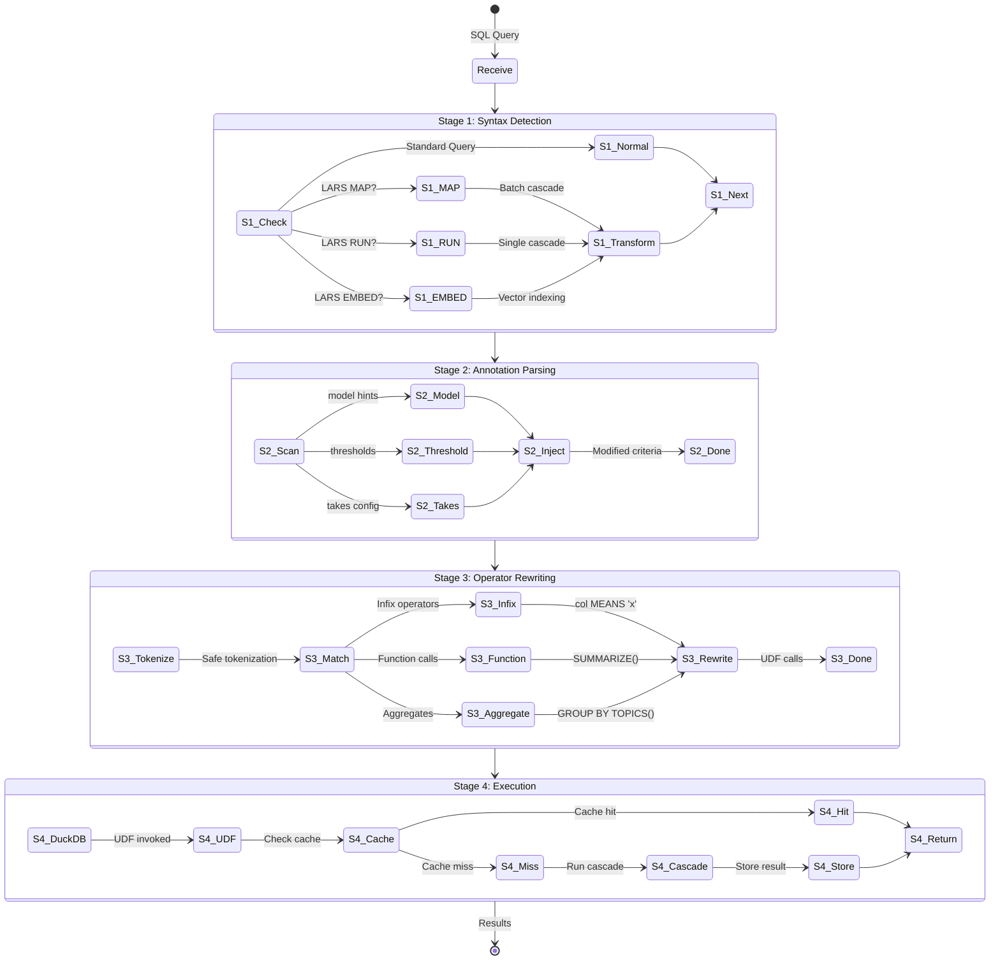

# Semantic SQL


Extend SQL with natural language understanding, LLM-powered functions, and semantic operators.
  LARS transforms your queries through intelligent rewriting - no database modifications needed.


> **INFO: Design Philosophy**
>
> 
> **Cascades All The Way Down.** Every semantic operator in LARS is backed by a cascade
>     definition. This means operators are declarative YAML files, not compiled code. You can inspect,
>     modify, or create new operators without touching Python - just add a cascade file and restart.
> 

On This Page
- [Architecture Overview](#architecture)
- [Query Processing Pipeline](#query-pipeline)
- [Semantic Operators](#operators)
- [UDF System](#udf-system)
- [PostgreSQL Wire Protocol Server](#sql-server)
- [Annotation System](#annotations)
- [Caching Strategies](#caching)
- [Creating Custom Operators](#custom-operators)
- [LARS MAP/RUN Statements](#map-run)
- [Best Practices](#best-practices)


## Architecture Overview


LARS's semantic SQL doesn't modify your database engine. Instead, it uses **query rewriting**
  to transform semantic operators into standard SQL + UDF calls that execute on DuckDB (in-process) or
  ClickHouse (persistence layer).


#### Query Rewriting


Your SQL with semantic operators is parsed, transformed, and rewritten into standard SQL
      with UDF calls. The original query never reaches the database directly.


#### Cascade-Backed UDFs


Each semantic function is implemented as a cascade. When a UDF executes, it runs the
      corresponding cascade with full observability, caching, and cost tracking.


#### Dynamic Discovery


Operators are discovered at startup from `cascades/semantic_sql/`. Add a new cascade file,
      restart, and your operator is available - no code changes needed.

### System Components


| Component             | Role                                             | Location                                   |
|-----------------------|--------------------------------------------------|--------------------------------------------|
| **SQL Rewriter**      | Transforms semantic SQL to standard SQL + UDFs   | `sql_rewriter.py`, `semantic_operators.py` |
| **Operator Registry** | Discovers and indexes cascade-backed operators   | `registry.py`, `dynamic_operators.py`      |
| **UDF Registration**  | Registers Python functions as DuckDB UDFs        | `udf.py`                                   |
| **PostgreSQL Server** | Wire protocol server for SQL client connectivity | `postgres_server.py`                       |
| **Cascade Executor**  | Runs the actual LLM workflows for each UDF call  | `executor.py`, `runner.py`                 |


## Query Processing Pipeline


When you send a query with semantic operators, it flows through a multi-stage transformation
  pipeline before execution. Understanding this pipeline helps you write efficient queries and
  debug issues.




> **TIP: Pipeline Stages**
>
> 
> **Stage 1 (Syntax Detection):** Identifies LARS-specific statements (MAP, RUN, EMBED) and handles them specially.
> 
> **Stage 2 (Annotation Parsing):** Extracts `-- @` annotations and injects hints into criteria strings.
> 
> **Stage 3 (Operator Rewriting):** Token-aware transformation of semantic operators to UDF calls. Avoids matching inside strings/comments.
> 
> **Stage 4 (Execution):** DuckDB executes the rewritten query, invoking cascade-backed UDFs with multi-level caching.
> 


### Rewriting Examples


Here's how different query patterns are transformed:

```infix operator rewriting
-- Original
SELECT * FROM tickets
WHERE description MEANS 'urgent customer issue';
-- Rewritten to
SELECT * FROM tickets
WHERE semantic_matches('urgent customer issue', description);
```

```score-based filtering
-- Original
SELECT * FROM articles
WHERE content ABOUT 'machine learning' > 0.7;
-- Rewritten to
SELECT * FROM articles
WHERE semantic_score('machine learning', content) > 0.7;
```

```aggregate function rewriting
-- Original
SELECT category, SUMMARIZE(review_text)
FROM reviews
GROUP BY category;
-- Rewritten to
SELECT category, summarize_2(to_json(LIST(review_text)))
FROM reviews
GROUP BY category;
```

```dimension function (semantic group by)
-- Original
SELECT TOPICS(title, 5) AS topic, COUNT(*) AS cnt
FROM articles
GROUP BY topic;
-- Rewritten to (simplified)
WITH _topics_json AS (
  SELECT llm_topics_discover(to_json(LIST(DISTINCT title)), 5) AS topics
  FROM articles
),
_classified AS (
  SELECT *, llm_classify_single(title, _topics_json.topics) AS _topic
  FROM articles, _topics_json
)
SELECT _topic AS topic, COUNT(*) AS cnt
FROM _classified
GROUP BY _topic;
```

### Token-Aware Safety


The rewriter tokenizes SQL before pattern matching, preventing false positives inside strings,
  comments, and quoted identifiers:

```safe rewriting
-- This MEANS inside a string is NOT rewritten
SELECT 'What this MEANS is important' AS note;
-- Output: 'What this MEANS is important' (unchanged)
-- This MEANS in SQL is rewritten
SELECT * FROM docs WHERE title MEANS 'report';
-- Output: ... WHERE semantic_matches('report', title)
```

## Semantic Operators


LARS ships with 50+ built-in operators organized into categories. Each is backed by a cascade
  in `cascades/semantic_sql/`.

### Operator Categories


| Category           | Examples                                             | Description                                     |
|--------------------|------------------------------------------------------|-------------------------------------------------|
| **Filtering**      | `MEANS`, `ABOUT`, `~`, `SIMILAR_TO`                  | Boolean/score filters based on semantic meaning |
| **Logic**          | `CONTRADICTS`, `IMPLIES`, `ALIGNS`                   | Semantic logic checking between texts           |
| **Transformation** | `ASK`, `EXTRACTS`, `CONDENSE`, `NORMALIZE`           | Per-row text transformation and extraction      |
| **Aggregation**    | `SUMMARIZE`, `THEMES`, `CONSENSUS`, `DEDUPE`         | LLM-powered aggregates (work with GROUP BY)     |
| **Dimension**      | `TOPICS()`, `SENTIMENT()`, `NARRATIVE()`             | Semantic GROUP BY - batch classification        |
| **Parsing**        | `PARSE`, `PARSE_NAME`, `PARSE_ADDRESS`, `SMART_JSON` | Structure extraction with structural caching    |
| **Data Quality**   | `QUALITY`, `VALID`, `ANONYMIZE`                      | Data assessment and cleaning                    |
| **MDM**            | `MATCH_PAIR`, `GOLDEN_RECORD`, `COALESCE_SMART`      | Master data management primitives               |
| **Vector**         | `EMBED`, `VECTOR_SEARCH`, `HYBRID_SEARCH`            | Embedding generation and similarity search      |


For detailed documentation of each operator, see [Built-in Operators](#operators).

### Operator Shapes


Operators come in three shapes, determining how they integrate with SQL:


#### SCALAR


Processes one row at a time. Called once per row in the result set.


Examples: `MEANS`, `SCORE`, `ASK`, `PARSE`


#### AGGREGATE


Processes multiple rows, returns one result per group. Works with GROUP BY.


Examples: `SUMMARIZE`, `THEMES`, `CONSENSUS`


#### DIMENSION


Two-pass: discovers buckets from all values, then classifies each row.


Examples: `TOPICS()`, `SENTIMENT()`, `NARRATIVE()`

## UDF System


At execution time, rewritten queries call User-Defined Functions (UDFs) registered with DuckDB.
  These UDFs are the bridge between SQL and cascade execution.

### Core UDFs


| UDF                                      | Purpose                           | Example                                                                     |
|------------------------------------------|-----------------------------------|-----------------------------------------------------------------------------|
| `lars_udf(instructions, value)`          | Simple LLM transformation per row | `SELECT lars_udf('Extract brand', name) FROM products`                      |
| `lars_cascade_udf(path, inputs)`         | Full cascade execution per row    | `SELECT lars_cascade_udf('skills/analyze.yaml', json_object('text', desc))` |
| `lars_run_batch(path, rows, table)`      | Batch cascade with temp table     | Used by `LARS RUN` statements                                               |
| `lars_map_parallel(path, rows, workers)` | Parallel cascade execution        | Used by `LARS MAP` with `PARALLEL`                                          |


### Embedding UDFs


| UDF                                                      | Purpose                                          |
|----------------------------------------------------------|--------------------------------------------------|
| `semantic_embed(text, model?)`                           | Generate embedding vector for text               |
| `vector_search_json_N(query, table, limit?, threshold?)` | Vector similarity search, returns JSON file path |
| `similar_to(text1, text2)`                               | Cosine similarity between two texts              |
| `skill(name, args_json)`                                 | Call any registered skill as a function          |


### LLM Aggregate UDFs


Aggregate UDFs collect values and process them in a single LLM call. DuckDB doesn't support
  function overloading, so aggregates use numbered suffixes:

```aggregate udf naming
-- These are the actual UDFs registered with DuckDB:
summarize_2(texts_json)       -- Summarize collected texts
llm_themes_2(texts_json, n)   -- Extract N themes
llm_cluster_2(texts_json, n)  -- Cluster into N groups
llm_consensus_2(texts_json)   -- Find common ground
classify_single(text, opts)   -- Classify into options
-- The rewriter converts high-level syntax to these:
SUMMARIZE(col) → summarize_2(to_json(LIST(col)))
THEMES(col, 5) → llm_themes_2(to_json(LIST(col)), 5)
```

### UDF Registration


When a DuckDB connection is created (either for PostgreSQL wire protocol or direct access),
  `register_lars_udf(conn)` is called to register all UDFs:

```udf registration (simplified)
def register_lars_udf(conn):
    # Core UDFs
    conn.create_function("lars", lars_impl, [...], "VARCHAR")
    conn.create_function("lars_cascade_udf", cascade_impl, [...], "VARCHAR")

    # Embedding UDFs
    conn.create_function("semantic_embed", embed_impl, [...], "DOUBLE[]")
    conn.create_function("similar_to", similarity_impl, [...], "DOUBLE")

    # Aggregate UDFs
    conn.create_function("summarize_2", summarize_impl, [...], "VARCHAR")
    conn.create_function("llm_themes_2", themes_impl, [...], "VARCHAR")

    # Dynamic registry-backed functions
    register_dynamic_sql_functions(conn)
```

## PostgreSQL Wire Protocol Server


LARS includes a PostgreSQL wire protocol server that lets you connect with any PostgreSQL
  client (DataGrip, DBeaver, psql, Python's psycopg2, etc.). Queries are processed through the
  full semantic SQL pipeline.

### Starting the Server


```server commands
# Start the SQL server
lars serve sql --port 15432

# Or shorter alias
lars sql server --port 15432

# Connect with psql
psql -h localhost -p 15432 -U lars -d lars

# Connect with Python
import psycopg2
conn = psycopg2.connect(host="localhost", port=15432, user="lars", dbname="lars")
```

### Session Architecture


Each client connection gets an isolated DuckDB session:


| Feature               | Behavior                                                                |
|-----------------------|-------------------------------------------------------------------------|
| **Session Isolation** | Each connection gets its own DuckDB instance (in-memory or file-backed) |
| **Database Routing**  | `memory`/`default` = in-memory; others = `session_dbs/{name}.duckdb`    |
| **UDF Registration**  | All UDFs registered automatically on connection                         |
| **Lazy Attach**       | External databases attached on-demand when referenced                   |
| **Cost Tracking**     | All UDF calls tracked to the session for analytics                      |
| **Thread Safety**     | Each connection has its own thread with locked DuckDB access            |


### Magic Tables


The server provides access to LARS's execution data through magic tables:

```magic tables
-- All execution logs
SELECT session_id, cell_name, model, cost
FROM all_data
WHERE cost > 0
ORDER BY timestamp DESC
LIMIT 100;
-- Evaluation data from takes
SELECT *
FROM all_evals
WHERE cascade_id = 'my_cascade';
```

## Annotation System


Annotations let you modify semantic operator behavior without changing SQL syntax.
  They're SQL comments that the rewriter recognizes and processes.

### Annotation Syntax


```annotation examples
-- @ use a fast model for this query
SELECT * FROM docs
WHERE title MEANS 'financial report';
-- @ threshold: 0.8
SELECT * FROM articles
WHERE content ABOUT 'sustainability';
-- @ takes.factor: 3
-- @ takes.evaluator: human
SELECT SUMMARIZE(feedback) FROM reviews;
```

### How Annotations Work


The annotation parser extracts `-- @` comments and injects them into the criterion
  string passed to the cascade. The cascade's bodybuilder (request mode) parses these hints:

```annotation processing
-- Original
-- @ use anthropic/claude-haiku
WHERE title MEANS 'urgent'
-- Criterion becomes:
"use anthropic/claude-haiku - urgent"
-- The cascade instructions can then reference this
```

### Available Annotations


| Annotation                           | Effect                                        |
|--------------------------------------|-----------------------------------------------|
| `-- @ free text`                     | Prepended to criterion (model hints, context) |
| `-- @ threshold: N`                  | Custom score threshold for ABOUT operators    |
| `-- @ takes.factor: N`               | Run cascade N times, pick best result         |
| `-- @ takes.evaluator: human|llm`    | Who picks the winning take                    |
| `-- @ takes.mode: rank_all|pick_one` | Selection mode for takes                      |


## Caching Strategies


LARS uses multiple caching layers to minimize LLM calls and maximize performance.

### Multi-Level Cache


```cache hierarchy
┌─────────────────────────────────────────┐
│ Level 1: In-Memory (per connection)     │
│ - Fastest, not shared, ephemeral        │
│ - Hash: MD5(instructions | value)       │
└────────────────────┬────────────────────┘
                     │ miss
                     ▼
┌─────────────────────────────────────────┐
│ Level 2: ClickHouse (persistent)        │
│ - Survives restarts, shared across      │
│ - TTL support: '1d', '2h', '30m'        │
└────────────────────┬────────────────────┘
                     │ miss
                     ▼
┌─────────────────────────────────────────┐
│ Execute Cascade (LLM call)              │
│ - Store result in both L1 and L2        │
└─────────────────────────────────────────┘
```

### Structural Caching (Parsing Functions)


Parsing functions use a special caching strategy that dramatically reduces LLM calls:


> **TIP: Code That Writes Code**
>
> 
> Instead of calling the LLM for every value, parsing functions:
> 
> 1. Analyze the **shape** of the input (e.g., `(DDD) DDD-DDDD` for phone)
> 2. Generate a SQL expression (regex) to parse that shape
> 3. Cache the SQL expression by shape fingerprint
> 4. Future values with the same shape use cached SQL - zero LLM cost
> 
> Parse a million phone numbers in 3 formats? That's 3 LLM calls, not a million.
> 


### Cache Configuration


Cascades can configure caching behavior in their `sql_function` block:

```cache configuration
sql_function:
  name: my_operator
  cache: true         # Enable caching (default: true)
  cache_ttl: "1d"     # Time-to-live: 1d, 2h, 30m, 60s
```

## Creating Custom Operators


The most powerful feature: define your own SQL operators using cascade files -
  **no Python code required**.

### Operator Discovery


At startup, LARS scans these directories for cascade files with `sql_function` blocks:
- `cascades/semantic_sql/*.cascade.yaml` - Built-in operators
- `skills/semantic_sql/*.cascade.yaml` - User overrides


### Cascade Structure


```cascades/semantic_sql/my_operator.cascade.yaml
cascade_id: my_custom_operator

# SQL function metadata - this is what makes it an operator
sql_function:
  name: my_op                         # Function name in SQL
  description: Check if text has property X
  args:                                # Function arguments
    - name: text
      type: VARCHAR
    - name: criterion
      type: VARCHAR
  returns: BOOLEAN                    # Return type: VARCHAR, BOOLEAN, DOUBLE, JSON
  shape: SCALAR                       # SCALAR, AGGREGATE, or DIMENSION
  operators:                          # SQL syntaxes that trigger this
    - "{{ text }} MY_OP {{ criterion }}"        # Infix syntax
    - "MY_OP({{ text }}, {{ criterion }})"      # Function syntax
  cache: true
  cache_ttl: "1h"

# Implementation - just like any cascade
cells:
  - name: evaluate
    model: google/gemini-2.5-flash-lite   # Fast, cheap model
    instructions: |
      Determine if the following text has property "{{ input.criterion }}".

      TEXT: {{ input.text }}

      Answer with ONLY "true" or "false", nothing else.
    output_schema:
      type: boolean
```

### Operator Patterns


The `operators` list defines SQL syntaxes that trigger the cascade. Patterns use
  Jinja2 template syntax with argument names:


| Pattern Type   | Example Pattern                       | SQL Usage                   |
|----------------|---------------------------------------|-----------------------------|
| Infix (word)   | `{{ text }} MEANS {{ criterion }}`    | `title MEANS 'report'`      |
| Infix (symbol) | `{{ a }} ~ {{ b }}`                   | `col1 ~ col2`               |
| Function       | `SCORE({{ text }}, {{ criterion }})`  | `SCORE(title, 'urgent')`    |
| Multi-word     | `{{ text }} RELEVANCE TO {{ query }}` | `content RELEVANCE TO 'ML'` |
| Postfix        | `{{ text }} SENTIMENT_SCORE`          | `review SENTIMENT_SCORE`    |


### Complete Example: Sentiment Score Operator


```cascades/semantic_sql/sentiment_score.cascade.yaml
cascade_id: semantic_sentiment_score
description: Score text sentiment from -1.0 to +1.0

sql_function:
  name: sentiment_score
  description: Returns sentiment score from -1.0 (negative) to +1.0 (positive)
  args:
    - name: text
      type: VARCHAR
  returns: DOUBLE
  shape: SCALAR
  operators:
    - "SENTIMENT_SCORE({{ text }})"
    - "{{ text }} SENTIMENT_SCORE"
  cache: true

cells:
  - name: score
    model: google/gemini-2.5-flash-lite
    instructions: |
      Analyze the sentiment of this text and return a score.

      TEXT: {{ input.text }}

      Return a JSON object with a single "score" field:
      - Score ranges from -1.0 (very negative) to +1.0 (very positive)
      - 0.0 is neutral

      Example: {"score": 0.7}
    output_schema:
      score: number
```


Now use it in SQL:

```using custom operator
-- Function syntax
SELECT
  product_id,
  AVG(SENTIMENT_SCORE(review_text)) AS avg_sentiment
FROM reviews
GROUP BY product_id
HAVING avg_sentiment < -0.3;
-- Postfix syntax
SELECT review_text, review_text SENTIMENT_SCORE AS sentiment
FROM reviews
ORDER BY sentiment DESC;
```

## LARS MAP/RUN Statements


Execute cascades directly in SQL, either mapping over rows or running once with all data.

### LARS MAP


Execute a cascade once per row in the result set:

```lars map syntax
-- Basic MAP: run cascade for each row
LARS MAP process_order('{{ order_id }}', '{{ email }}')
FROM (
  SELECT order_id, email
  FROM orders
  WHERE status = 'pending'
  LIMIT 100
);
-- With output column selection
LARS MAP enrich_customer('{{ customer_id }}')
RETURNING enriched_data, confidence_score
FROM customers;
```

### LARS RUN


Execute a cascade once with the entire result set as JSON:

```lars run syntax
-- Basic RUN: cascade receives all rows as JSON
LARS RUN analyze_trends('{{ results }}')
FROM (
  SELECT date, revenue, region
  FROM sales
  WHERE date >= '2024-01-01'
);
-- With temp table (cascade can query it)
LARS RUN complex_analysis
USING SELECT * FROM metrics WHERE date > '2024-01-01'
INTO results_table;
```

### MAP vs RUN


| Statement  | Cascade Calls | Data Access                    | Use Case                                       |
|------------|---------------|--------------------------------|------------------------------------------------|
| `LARS MAP` | Once per row  | Row values via Jinja2          | Per-row enrichment, notifications, processing  |
| `LARS RUN` | Once total    | All rows as JSON or temp table | Aggregate analysis, trend detection, reporting |


### LARS EMBED


Create embeddings for vector search:

```lars embed syntax
-- Index a column for vector search
LARS EMBED articles.content
FROM articles
WHERE published = true;
-- With options
LARS EMBED documents.summary
FROM documents
WITH (
  model = 'qwen/qwen3-embedding-8b',
  batch_size = 100
);
```

## Best Practices


### Performance


> **WARNING: LLM Call Costs**
>
> 
> Semantic operators call LLMs. For large datasets:
> 
> - Apply `WHERE` and `LIMIT` to reduce row count
> - Use `SIMILAR_TO` (embedding-based) instead of `MEANS` (LLM-based) when possible
> - Leverage caching - repeated values hit cache
> - Use dimension functions (`TOPICS()`) instead of scalar classification for GROUP BY
> 


### Query Design
- **Filter first**: Apply traditional filters before semantic operators
- **Use scores for ranking**: `SCORE()` + `ORDER BY` is often better than `MEANS` + `WHERE`
- **Batch with GROUP BY**: Aggregate functions process all values in one LLM call
- **Cache-friendly criteria**: Consistent criterion strings improve cache hit rates


### Debugging


```debugging queries
-- Check what your query rewrites to
EXPLAIN SELECT * FROM docs WHERE title MEANS 'report';
-- View recent UDF calls and costs
SELECT session_id, cell_name, model, cost, duration_ms
FROM all_data
WHERE is_sql_udf = true
ORDER BY timestamp DESC
LIMIT 20;
-- Check cache hit rates
SELECT
  udf_type,
  COUNT(*) AS calls,
  SUM(CASE WHEN cache_hit THEN 1 ELSE 0 END) AS hits
FROM sql_query_log
GROUP BY udf_type;
```

## Next Steps
- [Built-in Operators](#operators) - Complete reference for all 50+ operators
- [Vector Search & Embedding](#embedding) - Embedding details and SIMILAR_TO usage
- [Cell Types](#cell-types) - Using SQL cells in cascades
- [Tools Reference](#tools) - `sql_data` and related tools
